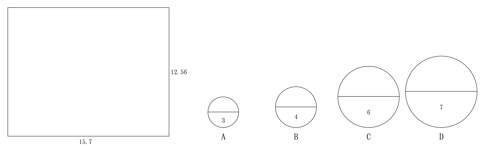
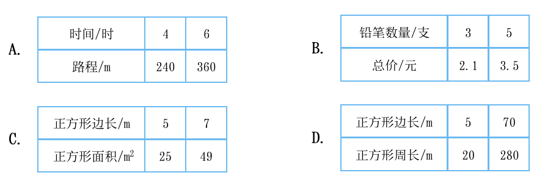
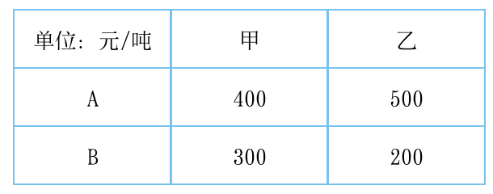
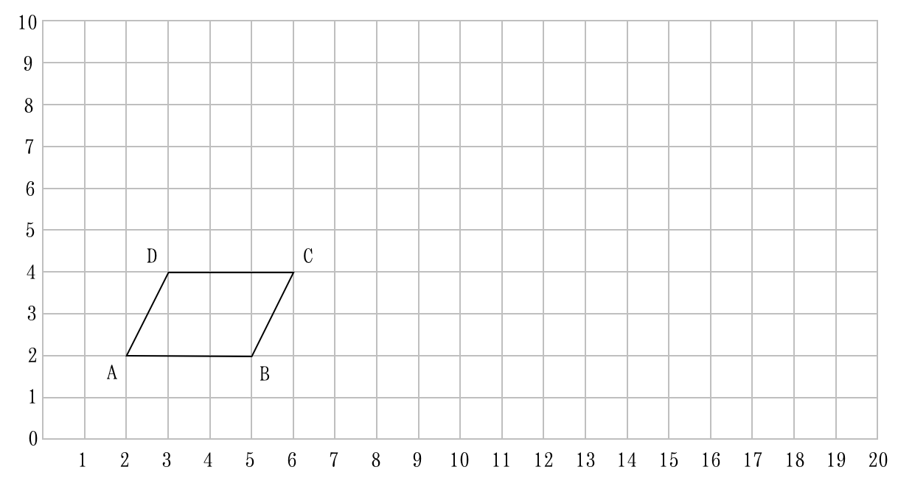
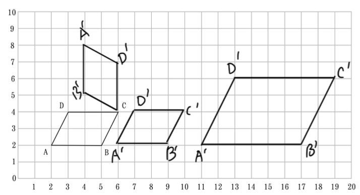
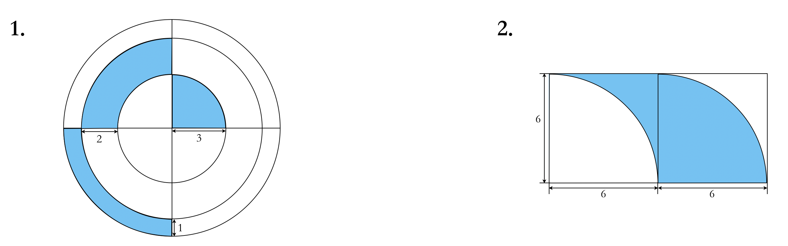
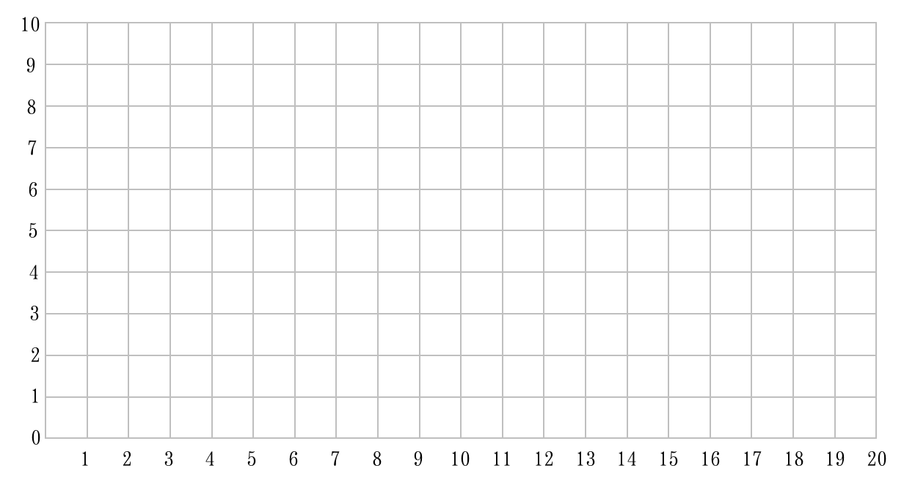
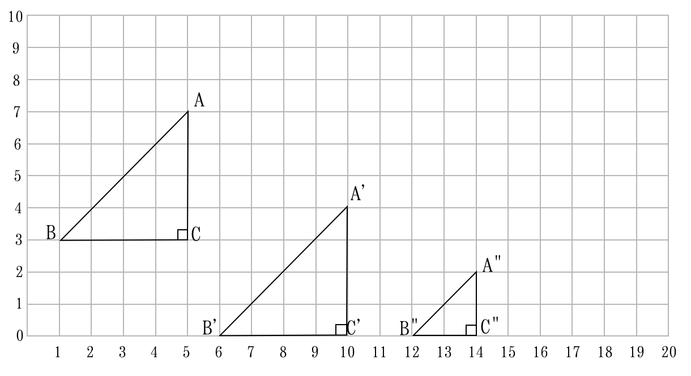

## 数学知识积累

##### 一、填空题

1. 一家黄金专卖店进行促销活动，降价了$10\%$，在此基础上，又返还$5\%$的现金，实际是降价了\_\_\_\_\_\_\_\_\_$\%$。

	解析: $\underline{14.5}\%$

2. 甲、乙两杯质量相同的糖水，已知甲杯中糖与水的质量比是$2:9$，乙杯中糖与水的质量比是$3:8$，现在把两杯糖水混合在一起，那么混合糖水中糖与糖水的质量比是\_\_\_\_\_\_\_\_\_$\,:\,$\_\_\_\_\_\_\_\_\_。

	解析: $\underline{5}:\underline{22}$

3. 小亮从家到学校，步行需要 $10$ 分钟，骑车需要 $5$ 分钟，骑车的速度比步行的速度快\_\_\_\_\_\_\_\_\_$\%$。

	解析: $\underline{100}\%$

##### 二、选择题

1. 如下图，用长方形纸作为侧面围成一个圆柱，围成的圆柱底面是(         )。(单位：cm)

	

	解析: B

	第一种围法：$15.7\div\,3.14=5$，不存在该选项；第二种围法：$12.56\div\,3.14=4$，选B。

2. 在一个高是$30cm$的圆锥形容器里盛满水，把这些水倒入一个与它等底等高的圆柱形容器中，水的高度是(         )。

	A. $10cm$         	B. $30cm$         C. $90cm$         D. $20cm$

	解析: A

	${1\over\,3}S_底\times\,30=S_底\times\,h\Rightarrow\,h={1\over\,3}\times30=10(cm)$

3. 把$5:9$的后项加上18，要使比值不变，前项可以(         )。

	A. 加上$18$         B. 加上$15$         C. 乘$3$         D. 乘$2$

	解析: $C$

4. 讨论长方体的体积，底面积和高之间是否成正、反比时，下面(         )的说法是错误的。

    A. 因为高越大，长方体的体积就越大，所以长方体的体积和高成正例。

    B. 因为长方体的$体积\div高=底面积$，所以当长方体的底面积一定时，长方体的体积和高成正比例。

    C. 当长方体的体积一定时，长方体的底面积扩大到原来的2倍，高就缩小到原来的$1\over2$，所以当长方体的体积一定时，底面积和高成反比例。

    D. 长方体的体积和高是两个相关联的量，高变化，长方体的体积也随着变化，当长方体的体积和高的比值和高的比值(底面积)一定时，长方体的体积和高成正比例。

	解析: $A$

5. 下面各表中相对应的两个量不成正比例的是(         )。

	

	解析: $C$

29. 已知每个人做某项工作的工作效率相同，$m$个人做$d$天可以完成，苦增加$r$人，则完成工作所需要的天数为(         )。

	A. $d+r$         B. $d-r$         C. ${md}\over{m+r}$         D. $d\over{m+r}$

	解析: $C$
    	==每个人的工作效率是${1\over\,md},{m+r}人的工作效率就是{{m+r}\over\,{md}}，完成全部工作需要的天数即为{1\div\,{{m+r}\over\,md}}={md\over\,{m+r}}$，故选C==

##### 三、判断题

1. 真分数除以假分数的商一定比1小。	(         )

	解析: &check;

	==分母>分子，分数值小于1==

2. 要清楚地反映出一只股票的涨跌变化情况，应选用条形统计图。	(         )

	解析: &cross;

	==折线图(曲线)==

3. 一个数的最大因数和最小倍数的积是这个数的平方。	(         )

	解析: &check; 

	==一个数的最大因数和最小倍数是本身。==

4. 2013年2月29日，小明在家开生日宴会。	(         )

	解析: &cross;

	==2013年不是润年，没有2月29日==

5. $10\over\,15$不能化成有限小数。	(         )

	解析: &check; 

	==最简分数的分母不含2、5之外的质因数则可以化成有限小数，否则不能==

##### 四、口算题

1. $7万 + 13万 =$

	解析: $20万$

2. $\frac 34 + {5\over\,12} =$

	解析: $1{1\over\,6}$

3. ${1\over2}\div{1\over2}+2\div{1\over2}=$

	解析: $5$

4. $4.8\div0.8=$

	解析: $6$

5. $24\times{3\over4}=$

	解析: $18$

6. $12\times({1\over4}+{1\over6})=$

	解析: $5$

7. $3260\div48\approx$

	解析: $65$

8. $28\times\,42\approx$

	解析: $1120到1260都对$

##### 五、解方程

1. $x-{15\over4}=6.25$

	

	解析: $x=10$

2. $0.8\times(x-0.4)=8$

	

	解析: $x=10.4$

3. ${2\over3}\div\,{5\over6}=x\div9$

	

	解析: $x=7.2$

4. ${1\over6}x+{1\over5}x-{1\over2}=5$

	

	解析: $x=15$

5. $2x-{4\over\,5}x=1.2$

	

	解析: $x=1$

##### 六、脱式计算

1. $3.15\times23-1.15\times23$

	

	解析: $46$

2. $\frac 35\times\,\frac 23 +\frac 56\div\frac 13$

	

	解析: $2.9$

3. $({5\over8}+{1\over27})\times8+{19\over27}$

	

	解析: $6$

4. $1042-384\div\,16\times\,13$

	

	解析: $730$

##### 七、应用题

1. 《镜花缘》是清代李汝珍创作的长篇小说，书中出现了一些有趣的数学现象。下面的题目是根据其中的一个问题改编的，你能解决吗？

	楼上灯有两种，甲种灯下一个大球，下缀两个小球，乙种灯下一个大球，下缀四个小球。大球共三十六个，小球共一百二十个。甲、乙两种灯各有多少盏？

	

	解析: 参考方法

	$$
	解：设甲种灯为x盏，那么乙种灯为(36-x)盏，根据小球总数为120个列方程\\
	2x+4\times\,(36-x)=120\\
	x=12\\36-x=36-12=24\\
	答：甲种灯有12盏，乙种灯有24盏。
	$$
   
2. 一艘轮船从甲港开往乙港，平均每时行$45km$，$8$时到达，原路返回时，平均每时行$30km$，需要多少时到达甲港？（列方程解应用题）

	

	解析: 参考方法

	$$
	解：设从乙港返回甲港需要x小时，根据两港之间距离不变列方程\\
	30x=48\times\,8\\
	x=12.8\\
	答：需要12.8小时。
	$$
   
3. 已知甲矿场有矿产30吨，乙矿场有矿产50吨，工地A需要35吨，工地B需要45吨，需要将甲、乙两个矿场的矿运往A、B两个工地，运费表如下表：

	$1)\quad假设甲场运往A地x吨，则总运费可用含x的代数式表示为$\_\_\_\_\_\_\_\_\_\_\_\_\_\_\_\_\_\_\_\_\_\_\_\_\_\_\_\_\_\_\_\_\_\_\_\_\_\_\_\_\_\_\_\_\_\_\_\_\_\_

	$2)\quad怎样安排能使得总运费最少，最少为多少元？$

	

	解析: 参考方法

   $$
   解：将第一问化简得：总运费是y=29500-200x，即(29500-y)与x成正比例\\
    x取值的范围是0～30（甲矿场所有的矿产），当x=30时，(29500-y)取得最大值.\\
    此时y的值最小，即运费最低:y_{min}=29500-200\times\,30=23500。\\
    答：甲矿场的矿产全部运往A地，总运费最少，最少为23500元。
   $$

##### 八、文字式题

1. $12的{6\over5}倍加上{3\over5}再去除{9\over10},商是多少？$

	

	解析: 参考方法

	$$
	解：{9\over\,10}\div(12\times\,{6\over\,5}+{3\over\,5})={3\over\,50}
	$$
   
2. 一个数与$5\over9$的比值等于$20$的$3\over4$，列方程求这个数。

	

	解析: 参考方法

	$$
	解：x:{5\over\,9}=20\times\,{3\over\,4};\;x=8{1\over\,3}
	$$
   
3. 甲数的25%是1.25，乙数是60的20%，乙数是甲数的百分之几？

	

	解析: 参考方法

	$$
	解：{{60\times\,20\%}\over\,{1.25\div\,0.25}}\times\,100\%=240\%
	$$

##### 九、操作题

1. 画一画，填一填。

	

	$1)\quad$画出平行四边形$ABCD$向右平移4格后的图形。点$A$平移后的位置用数对表示是\_\_\_\_\_\_\_\_\_。

	$2)\quad$画出将平行四边形$ABCD$绕$C$点按顺时针方向旋转$90$&deg;后的图形。点$D$旋转后的位置用数对表示是\_\_\_\_\_\_\_\_\_。

	$3)\quad$画出平行四边形$ABCD$按$2:1$的比放大后的图形。如果每个小方格表示$1cm^2$，那么放大后的平行四边形的面积是\_\_\_\_\_\_\_\_\_$cm^2$，放大后的平行四边形与原平行

	解析: $\underline{(6,2)}\quad\,\underline{(6,7)}\quad\,24$

	

2. 利用平移或旋转的知识求下面各图形中阴影部分的面积。（单位：cm）

	
	
	
	

	解析: 参考方法

	$$
	解：
	1:\quad{1\over\,4}\pi\times\,(1+2+3)^2=9\pi=28.26\\
	2:\quad{6\times6=36}
	$$

3. 按要求完成下面各题。

	$1)\quad在下面的方格纸上画一个直角三角形ABC，其中两个锐角顶点A、B分别在(5,7)和(1,3)的位置上，直角顶点$C$的位置是(\_\_\_\_\_\_\_\_\_,3)$。

	$2)\quad画出直角三角形ABC先向右平移5格，再向下平移3格后的图形。$

	$3)\quad画出直角三角形ABC，按1:2缩小后的图形。$

	

	解析: $\underline{5},\;如图$

	

