## 数学知识积累

##### 一、填空题


1. 一家黄金专卖店进行促销活动，降价了$10\%$，在此基础上，又返还$5\%$的现金，实际是降价了\_\_\_\_\_\_\_\_\_$\%$。

	解析: $\underline{14.5}\%$

2. 甲、乙两杯质量相同的糖水，已知甲杯中糖与水的质量比是$2:9$，乙杯中糖与水的质量比是$3:8$，现在把两杯糖水混合在一起，那么混合糖水中糖与糖水的质量比是\_\_\_\_\_\_\_\_\_$\,:\,$\_\_\_\_\_\_\_\_\_。

	解析: $\underline{5}:\underline{22}$

3. 小亮从家到学校，步行需要 $10$ 分钟，骑车需要 $5$ 分钟，骑车的速度比步行的速度快\_\_\_\_\_\_\_\_\_$\%$。

	解析: $\underline{100}\%$

4. 一个圆锥的体积是 $6.8dm^3$，底面积是 $3.4dm^2$，高是$\_\_\_\_\_\_\_\_\_dm$。

	解析: $\underline{6}dm$

5. 如果 $7A=9B$（A和B均不为0），那么$A : B = $\_\_\_\_\_\_\_\_\_$\,:\,$\_\_\_\_\_\_\_\_\_。   

	解析: $\underline{9}:\underline{7}$

6. 在比例 $7:28=9:36$ 中，如果将前一个比的后项减16，那么后一个比的前项应加上\_\_\_\_\_\_\_\_\_，比例仍然成立。

	解析: $\underline{12}$

7. 如下图，将左边的三角形按\_\_\_\_\_\_\_\_\_$\,:\,$\_\_\_\_\_\_\_\_\_的比缩小后，可以得到右边的三角形。缩小后的三角形的面积与原来三角形的面积比是\_\_\_\_\_\_\_\_\_$\,:\,$\_\_\_\_\_\_\_\_\_。 

	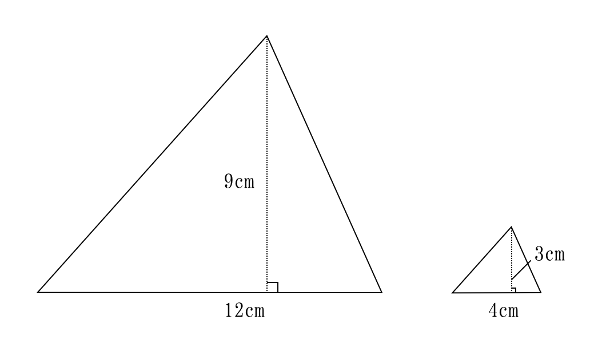

	解析: $\underline{1}:\underline{3}\quad\,\underline{1}:\underline{9}$

8. 一个圆柱的侧面展开后恰好是一个正方形，这个圆柱的高是底面直径的\_\_\_\_\_\_\_\_\_倍。

	解析: $\underline{\pi}$

9. 旋转不改变图形的\_\_\_\_\_\_\_\_\_和\_\_\_\_\_\_\_\_\_，只改变图形的\_\_\_\_\_\_\_\_\_和位置。

	解析: $\underline{形状}\quad\underline{大小}\quad\underline{方向}$ 

10. 把正方形按$2:1$的比放大，放大后的正方形的面积是原正方形的\_\_\_\_\_\_\_\_\_倍。

	解析: $\underline{4}$

11. 台湾岛是我国第一大岛，面积有三万五千七百五十九平方千米，写作\_\_\_\_\_\_\_\_\_平方千米，以“万”作为单位，保留一位小数约是\_\_\_\_\_\_\_\_\_万平方千米。

	解析: $\underline{3579}$; $\underline{3.6}$

12. 小王叔叔经营的小饭店上半年营业额是40万元。若按营业额的5%缴纳营业税应缴纳营业税款\_\_\_\_\_\_\_\_\_万元。小王叔叔把剩下的这些钱存入银行(定期两年)，已知两年期的年利率为2.43%，存款的利息要按20%税率纳税。两年后，小王叔叔实得本金和税后利息共\_\_\_\_\_\_\_\_\_万元(得数保留两位小数)。

    解析: $\underline{2}$ ; $\underline{39.48}$

13. 在一个长、宽、高分别为40厘米、50厘米、60厘米的长方体水箱中有$A、B$两个进水管，先开$A$管，经过一段时间后两管同开，下面的折线图表示进水情况，请根据图回答问题。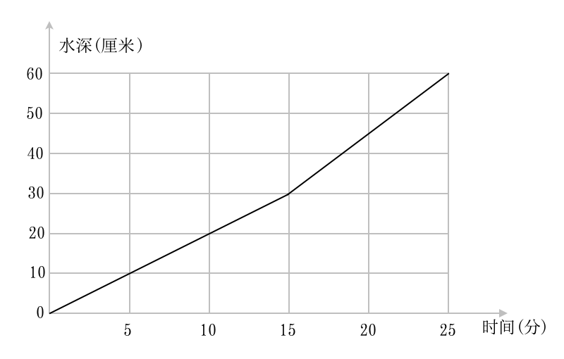

	$1)\quad$$A$管开放\_\_\_\_\_\_\_\_\_分钟后，$B$管才开始与$A$管同时进水。

	$2)\quad$$B$管开始进水时，水箱的水已有\_\_\_\_\_\_\_\_\_厘米。

	$3)\quad$$A,B$两管同时进水，每分钟进水\_\_\_\_\_\_\_\_\_毫升。

	解析: $\underline{15}\quad\,\underline{30}\quad\,\underline{6000};$

14. 一个圆的半径是$6cm$，它的周长是\_\_\_\_\_\_\_\_\_$cm$，面积是\_\_\_\_\_\_\_\_\_$cm^2$。

	解析: $\underline{12}\quad\,\underline{36}\quad$

15. 在下列括号里填上适当的单位或数字。

	数学试卷的长度约是60\_\_\_\_\_\_\_\_\_；你的脉搏一分钟大约跳\_\_\_\_\_\_\_\_\_次；8个鸡蛋大约有500\_\_\_\_\_\_\_\_\_；小刚跑一百米的时间大约是14\_\_\_\_\_\_\_\_\_；一间教室的占地面积大约是40\_\_\_\_\_\_\_\_\_；7.2小时=\_\_\_\_\_\_\_\_\_小时\_\_\_\_\_\_\_\_\_分；2千克60克=\_\_\_\_\_\_\_\_\_千克。

	解析: $\underline{cm}\quad\,\underline{100}\quad\,\underline{g}\quad\,\underline{s}\quad\,\underline{m^2}\quad\,\underline{7}\quad\,\underline{12}\quad\,\underline{2.06}\quad$

16. 有一个由相同的小正方形组成的物体，从它的正面和右面看分别如下图，这个物体最多是由\_\_\_\_\_\_\_\_\_个小正方体组成的，最少是由\_\_\_\_\_\_\_\_\_个小正方体组成的。

	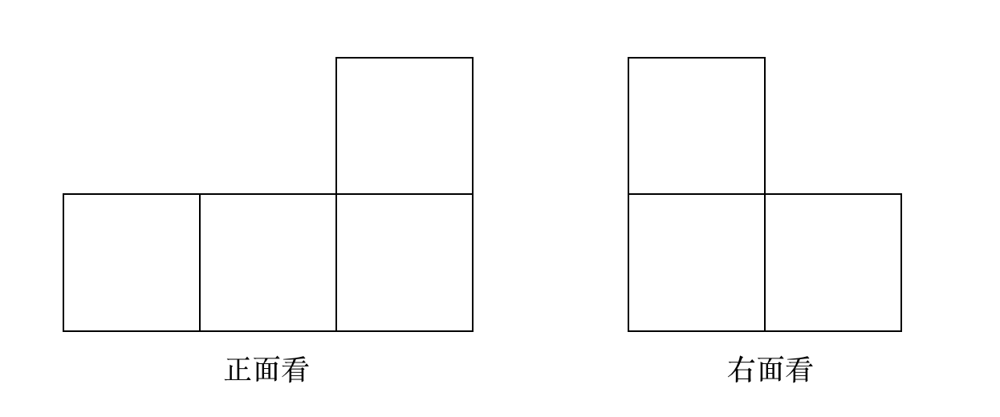

	解析: $\underline{7}\quad\,\underline{5}\quad$

17. 把周长为$18.84cm$的平均分成两个半圆，每个半圆的周长是\_\_\_\_\_\_\_\_\_$cm$。

	解析: $\underline{15.42}\quad\,或\underline{6+3\pi}\quad$

18. 如图，已知阴影三角形的面积是$50dm^2$，则圆的面积是\_\_\_\_\_\_\_\_\_$dm^2$。

	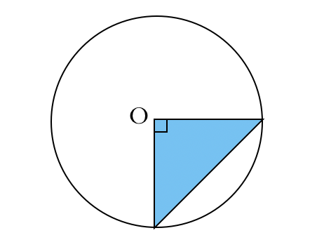

	解析: $\underline{314}\quad\,或\underline{100\pi}\quad$

19. 如图，两个正方形有一部分重叠在一起。甲正方形中重叠部分与涂色部分的面积比是$3:13$，乙正方形中重叠部分与涂色部分的面积比是$1:2$，则甲正方形与乙正方形的面积比是\_\_\_\_\_\_\_\_\_。

	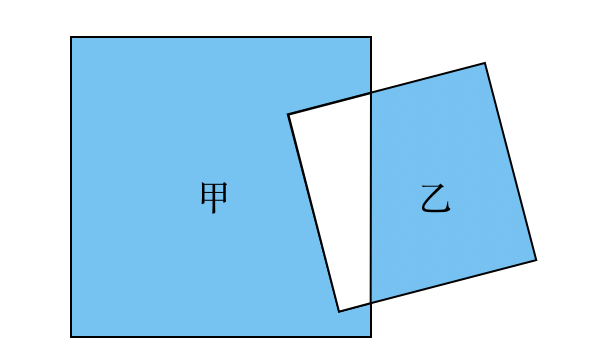

	解析: $\underline{16:9}\quad$

20. 一块蔬菜地中种着青椒、黄瓜、丝瓜和茄子四种蔬菜。如图表示各种蔬菜的种植面积占总面积的百分比。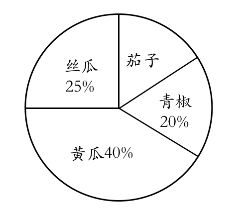

	$1)\quad$茄子的种植面积占菜地总面积的$\_\_\_\_\_\_\_\_\_\%$。

	$2)\quad$如果丝瓜的种植面积是$30m^2$，这块蔬菜地的总面积是$\_\_\_\_\_\_\_\_\_m^2$。

	$3)\quad$\_\_\_\_\_\_\_\_\_的种植面积最大，比丝瓜的种植面积大这块蔬菜地的$\_\_\_\_\_\_\_\_\_\%$。

	解析: $\underline{15\%}\quad\,\underline{120}\quad\,\underline{15\%}\quad$

21. 在横线上填上适当的分数。$45分=\_\_\_\_\_\_\_\_\_$时；$80dm^2=\_\_\_\_\_\_\_\_\_m^2$

	解析: $\underline{3\over\,4}\quad\,\underline{4\over\,5}\quad$

22. 两个相关联的量，一种量变化，别一种量也随着变化，如果这两种量中相对应的两个数的\_\_\_\_\_\_\_\_\_一定，这两种量就叫做成反比例的量，他们的关系叫做\_\_\_\_\_\_\_\_\_关系。

	解析: $\underline{积}\quad\,\underline{反比例}\quad$

23. 一个长方形的宽是 $3\over8$，长是宽的 $4\over3$，这个长方形的面积是\_\_\_\_\_\_\_\_\_平方米。(填分数)

	解析: $\underline{3\over\,16}\quad$

24. 一个长方体长9厘米，宽5厘米，高4厘米，如果把它按体积比是 $2:3:4$切成三个小长方体，其中最小的长方体体积是\_\_\_\_\_\_\_\_\_立方厘米。

	解析: $\underline{40}\quad$

25. $6时40分=\_\_\_\_\_\_\_\_\_$时，$5千克80克=\_\_\_\_\_\_\_\_\_$千克。

	解析: $\underline{6{2\over\,3}}\quad\,\underline{5.08}\quad$

26. 一个长方体的棱长总和是48厘米，它的长、宽、高的比是 $3:2:1$，它的体积是\_\_\_\_\_\_\_\_\_。

	解析: $\underline{48cm^3}\quad$

27. 客车从甲地到乙地需要7小时，货车从乙地到甲地需要9小时，客车和货车的速度比是\_\_\_\_\_\_\_\_\_。

	解析: $\underline{9:7}\quad$

28. 10吨增加它的$1\over5$后，再减少$1\over5$吨，还剩下\_\_\_\_\_\_\_\_\_吨。

	解析: $\underline{11.8}\quad$

29. $3500立方分米$=\_\_\_\_\_\_\_\_\_$立方米$。

	解析: $\underline{3.5}$

30. 264908085读作\_\_\_\_\_\_\_\_\_，把它写成用万作单位的数是\_\_\_\_\_\_\_\_\_，省略到亿位记做\_\_\_\_\_\_\_\_\_。

	解析: $\underline{二亿六千四百九拾万八千零八拾五}\quad\,\underline{26490.8085万}\quad\,\underline{3亿}$

31. $1时45分=\_\_\_\_\_\_\_\_\_$分。

	解析: $\underline{105}$

32. 如图，把圆分成若干等份，拼剪成一个近似的长方形，已经长方形的宽是4厘米，长是\_\_\_\_\_\_\_\_\_厘米。

	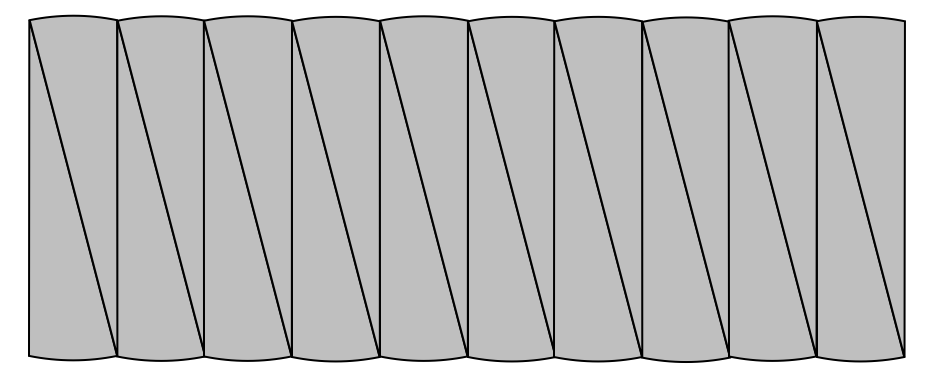

	解析: $\underline{12.56}\, 或\,\underline{4\pi}$

33. 一道除式，商是22，余数是6，被除数与除数的和是259，这道除式的除数是\_\_\_\_\_\_\_\_\_，被除数是\_\_\_\_\_\_\_\_\_。

	解析: $\underline{11}\quad\,\underline{248}$

34. 由1、2、3这三个数字能组成的三位数一共有\_\_\_\_\_\_\_\_\_个，他们的和是\_\_\_\_\_\_\_\_\_。

	解析: $\underline{6}\quad\,\underline{1332}$

35. 小明有15本故事书，比小英的3倍多a本，小英有\_\_\_\_\_\_\_\_\_本故事书。

	解析: $\underline{(15-a)\div\,3}$

36. 两个数相除的商是7.83，如果把被除数和除数的小数点同时向右移动一位，商是\_\_\_\_\_\_\_\_\_。

	解析: $\underline{7.83}$

37. 一个带小数的整数部分与小数部分的值相差88.11，整数部分的值恰好是小数部分的100倍，这个数是\_\_\_\_\_\_\_\_\_。

	解析: $\underline{89.89}$

38. 如图中圆柱的底面半径是\_\_\_\_\_\_\_\_\_，把这个圆柱的侧面展开可以行到一个长方形，这个长方形的面积是\_\_\_\_\_\_\_\_\_，这个圆柱体的体积是\_\_\_\_\_\_\_\_\_。(圆周率为 $\pi$)

	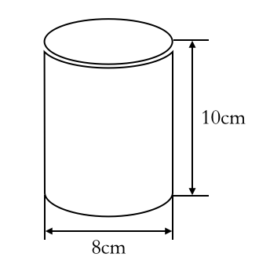

	解析: $\underline{4}\quad\,\underline{80\pi cm^2}\quad\,\underline{160\pi cm^3}$

39. $7\begin{aligned}\boxed { ？}\end{aligned}8\begin{aligned}\boxed{？}\end{aligned}$能同时被2、3、5整除，个位只能填\_\_\_\_\_\_\_\_\_，百位只能填\_\_\_\_\_\_\_\_\_。

	解析: $\underline{0}\quad\,\underline{3,6,9}$

40. 用两个“9”和三个“0”组成一个最小的五位数，并且只读出一个0，这个五位数是\_\_\_\_\_\_\_\_\_，最高位上的数表示\_\_\_\_\_\_\_\_\_，最低位上的数表示\_\_\_\_\_\_\_\_\_，这个数的计数单位是\_\_\_\_\_\_\_\_\_。

	解析: $\underline{90009}\quad\,\underline{9万}\quad\,\underline{9个}\quad\,\underline{个}$

41. 在$0.9292，0，50，1.02，1，3.\dot5\dot6，3.5\dot4$中，整数有\_\_\_\_\_\_\_\_\_；自然数有\_\_\_\_\_\_\_\_\_；小数有\_\_\_\_\_\_\_\_\_；小数中的有限小数有\_\_\_\_\_\_\_\_\_；纯循环小数是\_\_\_\_\_\_\_\_\_；混循环小数是\_\_\_\_\_\_\_\_\_。

	解析: $\underline{0，1，50}\quad\,\underline{1，50}\quad\,\underline{0.9292,1.02,3.\dot5\dot6,3.5\dot4}\quad\,\underline{0.9292,1.02}\quad\,\underline{3.5\dot4}\quad\,\underline{3.\dot5\dot6}$

42. 数${8\over15}$表示的意义是\_\_\_\_\_\_\_\_\_，${8\over15}$吨表示的意义是\_\_\_\_\_\_\_\_\_，${8\%}$表示的意义是\_\_\_\_\_\_\_\_\_。

	解析: $\underline{将1平均分成15份，其中的8份为{8\over15}}\quad\,\underline{将1吨平均分成15份，其中的8份为{8\over15}}吨\quad\,\underline{ 一个数是另一个数的百分之八}$

43. 在括号里填上一个恰当的数，使${5\over6}>{7\over(\quad)}>{2\over3}$成立。

	解析: $\underline{9}$

44. 分数$2\over5$，如果分母加上10，分子应加上\_\_\_\_\_\_\_\_\_，才能使分数大小不变。

	解析: $\underline{4}$

45. 一个数如果加上这个数与它的倒数相乘的积得$2\frac 13$，这个数的倒数是\_\_\_\_\_\_\_\_\_。

	解析: $\underline{3\over\,4}$

46. 从$0，1，2，3，5，7$中选出三个数字，组成一个既能被5整除，又能被3整除的最大三位数，这个三位数是\_\_\_\_\_\_\_\_\_。

	解析: $\underline{750}$

47. 20千克比\_\_\_\_\_\_\_\_\_轻$20\%$，\_\_\_\_\_\_\_\_\_米比5米长$1\over\,3$。

	解析: $\underline{25千克}\quad\,\underline{6{2\over\,3}}$

48. 一段电线，长$2\over\,5$米，截去$1\over\,5$后，再接上$4$米，结果比原电线长\_\_\_\_\_\_\_\_\_米。

	解析: $\underline{3.92}$

49. 在$2\frac 56，2.84，283.3\%，2.8383\dots$中，从大到小排为\_\_\_\_\_\_\_\_\_。

	解析: $\underline{2.84>2.8383\dots>2{5\over\,6}>283.3\%}$ 

50. $3\frac 2{25}吨=\_\_\_\_\_\_\_\_\_吨\_\_\_\_\_\_\_\_\_千克。$

	解析: $\underline{3}\quad\,\underline{80}$

51. 一项工作，6月1日开工，原定一个月完成，实际施工时，6月25日完成，到6月30日超额完成\_\_\_\_\_\_\_\_\_$\%$。

	解析: $\underline{20\%}$

52. 看图填空。小华骑车从家去相距5千米的图书馆借书，从所给的折线统计图可以看出：小华去图书馆路上停车停车\_\_\_\_\_\_\_\_\_分，在图书馆借书用\_\_\_\_\_\_\_\_\_分，从家中去图书馆，平均速度是每小时\_\_\_\_\_\_\_\_\_千米，从图书馆返回家中，速度是每小时\_\_\_\_\_\_\_\_\_千米。

	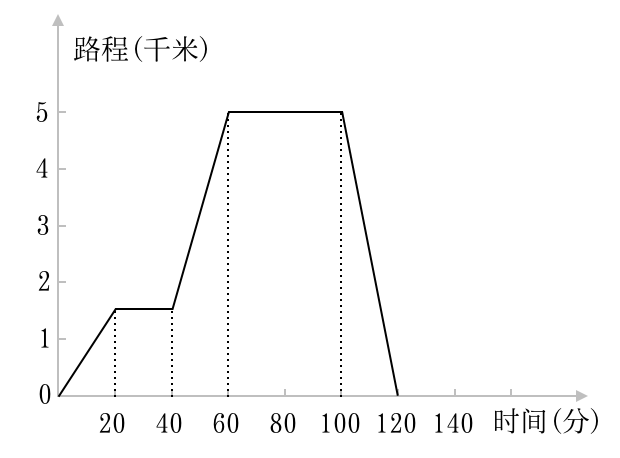

	解析: $\underline{20}\quad\,\underline{40}\quad\,\underline{5}\quad\,\underline{15}$

53. 一个数的近似数是0.050，这个数必须大于或等于\_\_\_\_\_\_\_\_\_且小于\_\_\_\_\_\_\_\_\_。

	解析: $\underline{0.0495}\quad\,\underline{0.0504}$

54. 把${1\over\,7}$化成小数后，小数点后第一百位上的数字是\_\_\_\_\_\_\_\_\_，若把小数点后面的一百个数字相加，所得的和是\_\_\_\_\_\_\_\_\_。

	解析: $\underline{8}\quad\,\underline{447}$

55. 两个数的最大公约数是4，最小公倍数是60，且这两个数不为4和60，那么这两个数为\_\_\_\_\_\_\_\_\_和\_\_\_\_\_\_\_\_\_。

	解析: $\underline{12}\quad\,\underline{20}$

56. 一个圆柱体高减少2厘米，表面积就减少18.84平方厘米，这个圆柱上下两个底面面积之和是\_\_\_\_\_\_\_\_\_。

	解析: $\underline{14.13}$

57. 甲乙两个打字员，每分钟打字数的比是5:6，打字时间比是12:11，这两个打字员打字总数比是\_\_\_\_\_\_\_\_\_。

	解析: $\underline{10:11}$

58. 在一幅比例尺为$1:600000$的地图上，表示$72$千米的距离，地图上应画\_\_\_\_\_\_\_\_\_厘米。

	解析: $\underline{12}$

59. 做$10$节底面直径$20$厘米，长$1$米的烟囱，至少需要\_\_\_\_\_\_\_\_\_平米的铁皮。

	解析: $\underline{6.28}$

60. 一个三角形的三个角的度数比是$1:2:1$，这个三解形是\_\_\_\_\_\_\_\_\_三角形。

	解析: $\underline{等腰直角}$

61. 一个最简分数，把它的分子缩小5倍，分母扩大2倍可以化简成$1\over\,25$，原来这个最简分数是\_\_\_\_\_\_\_\_\_。

	解析: $\underline{2\over\,5}$

62. 今年“教师节”是星期一，明年“教师节”是星期\_\_\_\_\_\_\_\_\_。

	解析: $\underline{二}$

63. 两个圆周长之比是$3:2$，面积之差是$10$平方米，两个圆面积之和是\_\_\_\_\_\_\_\_\_平方米。

	解析: $\underline{26}$

64. 24可以分为几对不同质数的和，这几对质数分别是$\_\_\_\_\_\_\_\_\_\_\_\_\_\_\_\_\_\_$。

	解析: $\underline{(5,19),(7,17),(11,13)}$

65. 一个两位数，个位上和十位上的数字都是合数，并且是互质数，这个数最大是\_\_\_\_\_\_\_\_\_。

	解析: $\underline{98}$

66. 有甲乙两家商店，如果甲店的利润增加$20\%$，乙店的利润减少$20\%$，那么两店的利润相等。原来甲店利润是乙店利润的\_\_\_\_\_\_\_\_\_$\%$。

	解析: $\underline{66.7\%}$

67. 把表面积是8平方分米的正方体切成体积相等的8个小正方体，每个小正方体的表面积是\_\_\_\_\_\_\_\_\_。

	解析: $\underline{8\div\,6\div\,4\times\,6=2 dm^2}$

68. 2002年世界杯足球赛中每胜一场得3分，平一场得1分，负一场0分，下面是一个小组赛的得分情况，请将空白处填出来。

	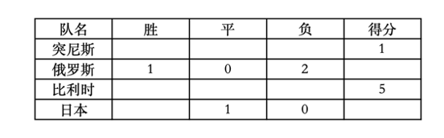

	解析: 

	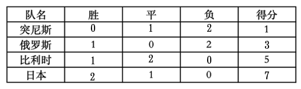

69. 密封的瓶中，如果放进一个细菌，60秒后充满了细菌。已知每个细菌每秒分裂成2个，两秒分裂成4个，如果开始放8个细菌，要使瓶中充满细菌最少需要\_\_\_\_\_\_\_\_\_秒。

	解析: $\underline{8\times\,2^x=2^{60} => x=57}$

70. 右图中阴影部分的面积是\_\_\_\_\_\_\_\_\_平方厘米。（$\pi 取3.14$）

	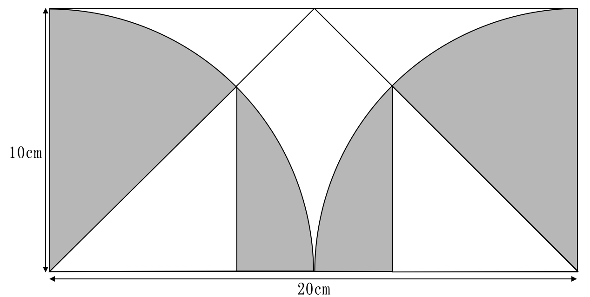

	解析: $\underline{\pi\times10^2\div\,2 - {1\over\,2}\times\,10^2=50\pi -100=57}$

71. 有一堆棋子，排列成$n\times\,n$ 的正方形方阵，多余出3枚棋子；如果在这个正方形方阵橫纵两个方向各增加一行，则缺少8枚棋子，则这堆棋子有\_\_\_\_\_\_\_\_\_枚。

	解析: $\underline{28}$

72. 爸爸给汽车加了20升92\#汽油，花了92元。总价与数量的比是$\_\_\_\_\_\_\_\_\_:\_\_\_\_\_\_\_\_\_$，比值\_\_\_\_\_\_\_\_\_，这个值表示的是\_\_\_\_\_\_\_\_\_。

	解析: $\underline{92}:\underline{20}\quad\,\underline{4.6}\quad\,\underline{每升92\#汽油价格是4.6元}$

73. 小明用圆规画了一个圆，圆规两脚张开的大小是1厘米，画出圆的周长是\_\_\_\_\_\_\_\_\_，面积是\_\_\_\_\_\_\_\_\_。

	解析: $\underline{2\pi 或 6.28 cm}\quad\,\underline{\pi 或 3.14 cm^2}$

74. 在比例尺是$20:1$的图纸上量得一个零件的直径是4厘米，这个零件直径的实际长度是\_\_\_\_\_\_\_\_\_毫米。

	解析: $\underline{2}$

75. 一个直角三角形的两条直角边分别是3厘米和4厘米，斜边5厘米，如果以4厘米长的直角边为轴把三角形旋转一周，得到一个圆锥体，这个圆锥体的高度是\_\_\_\_\_\_\_\_\_厘米，底面半径是\_\_\_\_\_\_\_\_\_厘米，体积是\_\_\_\_\_\_\_\_\_立方厘米。

	解析: $\underline{3}\quad\,\underline{{1\over3}\times\,\pi\times\,3^2\times\,4=12\pi/37.68}$

76. 在一个正方体的顶面和侧面各画一条对角线$AB和AC$（如图），想一想，$AB与AC$所组成的夹角是\_\_\_\_\_\_\_\_\_。

	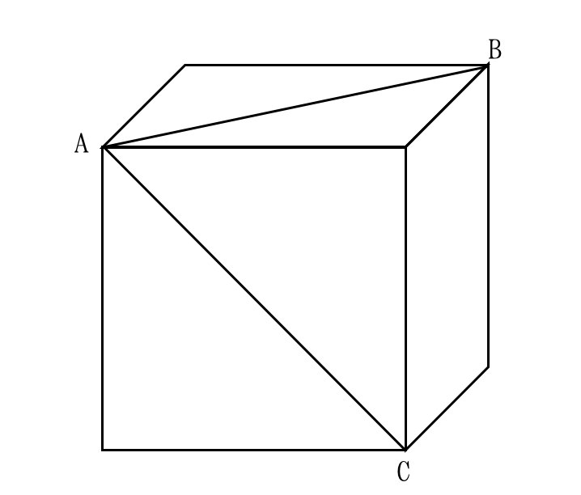

	解析: $\underline{60\degree}$

77. 已知$a^2-a-1=0，则a^2-a+2016=$\_\_\_\_\_\_\_\_\_。

	解析: $a^2-a-1=0,a^2-a+2016=a^2-a-1+2017=0+2017$

78. 如图，从左边第一个格子开始向右数，在每个小格子中都填入一个整数，使得其中任意三个相邻格子所填整数之和都相等，则第2016个格子中的数为\_\_\_\_\_\_\_\_\_。

	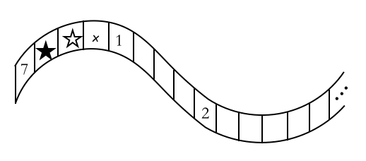

	解析: $\underline{7}$

	任意三个相邻格子的数字之和相等，说明规律是按3个数字循环，图中已经给出了3个数，1之前的x应该是7的第一次循环，故x=7，★的第一次循环是1，故★=1，☆则是2，所以整体规律是按7、1、2的顺序循环。第2016个数由于是3的整倍，所以应该是2

79. 一部分同学围在一起做“传数”游戏，我们把某同学传给后面的同学的数字称为该同学的“传数”。游戏规则是：同学1心里先想好一个数，将这个数乘以2再加1传给同学2，同学2把同学1告诉他的数除以2再减${1\over2}$后再传给同学3，同学3把同学2传给他的数乘以2再加1传给同学4，同学4把同学把同学3告诉他的数除以2再减$1\over2$后传给同学5，同学5把同学4传给他的数乘以2再加1后传给同学6，按照上述规律，序号排在前面的同学继续依次传数给后面的同学，直到传数给同学1为止。若有$n$个同学($n为大于1的偶数$)做“传数”游戏，这$n$个同学“传数”之和为$20n$，则同学1心里先想好的数是\_\_\_\_\_\_\_\_\_。

	解析: $\underline{13}$

	设同学1想好的数为$x$，根据规则，编号为奇数项的同学获得的传数是x，编号为偶数的同学获得的传数是$2x+1$，那么n个同学的传数之和是$20n可列方程：{n\over2}\times{x}+{n\over2}\times(2x+1)=20n，x=13$

80. 学校建综合楼，实际投资120万元，节约了30万元，节约了百分之几？

	列式：\_\_\_\_\_\_\_\_\_\_\_\_\_\_\_\_\_\_\_\_\_\_\_\_\_\_\_\_\_\_\_\_\_\_\_\_\_\_\_\_\_\_\_\_\_\_\_\_\_\_

	解析: $\underline{30\div\,(120+30)\times\,100\%=20\%}$

81. 某个体户，去年12月份营业收入5000元，按规定要缴纳3%的营业税。纳税后还剩多少钱？

	列式：\_\_\_\_\_\_\_\_\_\_\_\_\_\_\_\_\_\_\_\_\_\_\_\_\_\_\_\_\_\_\_\_\_\_\_\_\_\_\_\_\_\_\_\_\_\_\_\_\_\_

	解析: $\underline{5000\times\,(1-3\%)=4850(元)}$

82. 甲、乙两地相距300千米，甲行完全程要20小时，乙行完全程要30小时，现两个同时从甲、乙两地相向而行，多少小时相遇？

	列式：\_\_\_\_\_\_\_\_\_\_\_\_\_\_\_\_\_\_\_\_\_\_\_\_\_\_\_\_\_\_\_\_\_\_\_\_\_\_\_\_\_\_\_\_\_\_\_\_\_\_

	解析: $\underline{5000\times\,(1-3\%)=4850(元)}$

83. 一个房间铺地砖，如果用面积为16平方分米的方砖铺至少需要150块。如果改用边长为5分米的方砖铺，至少需要多少块？(用比例知识解答)

	解：设至少需要x块。

	方程：\_\_\_\_\_\_\_\_\_\_\_\_\_\_\_\_\_\_\_\_\_\_\_\_\_\_\_\_\_\_\_\_\_\_\_\_\_\_\_\_\_\_\_\_\_\_\_\_\_\_

	解析: $\underline{5000\times\,(1-3\%)=4850(元)}$

84. 一个长方体的高减少4厘米后成为一个正方体，并且表面积减少48平方厘米，这个长方体的体积是\_\_\_\_\_\_\_\_\_立方厘米。

	解析: 63

	$48\div4\div4=3=>底面边长为3\quad体积为:3\times3\times(3+4)=63$

85. a、b两个自然数的最大公因数是3，它他的最小公倍数是\_\_\_\_\_\_\_\_\_。

	解析: ${ab\over3}$

	$设a=3x;b=3y,a、b的最小公倍数为3xy={ab\over3}$

86. 在$1:30000000$的地图上，量得A、B两地的图上距离是2.3厘米，AB两地的实际距离是\_\_\_\_\_\_\_\_\_千米。

	解析: 690

	$2.3\times{30000000\div100000}=690$

87. 3小时27分钟$=$\_\_\_\_\_\_\_\_\_小时，2立方米40立方分米$=$\_\_\_\_\_\_\_\_\_立方分米。

	解析: $3{9\over20}\quad2040$

88. 如图，有一个长方形的色块图案，这个图案由六个正方形拼成，其中最小的正方形边长为1，则长方形色块的面积是\_\_\_\_\_\_\_\_\_。

	

	解析: 143

	$设次小的正方形连长为x,x+1=2x-3=>x=4;面长为(3x+1)\times(3x-1)=9x^2-1=12^2-1=143$

89. 往装有液体的圆柱形桶中放入大、小两种球共10个（液体不溢出），液面上升24cm，已知每个大球可使液面上升3cm，每个小球可使液面上升2cm，放入了大球\_\_\_\_\_\_\_\_\_个，小球\_\_\_\_\_\_\_\_\_个。

	解析: $4\quad6\quad,鸡兔同笼问题。$x+y=10;3x+2y=24$

90. 某校五年级（共3个班）的学生排队，每排3人、5人或7人，最后一排都只有2人，这个学校五年级有\_\_\_\_\_\_\_\_\_名学生。

	解析: 107

	$3\times5\times7+2=107$

91. 有这样一个数字游戏，将1，2，3，4，5，6，7，8，9这九个数字分别填在如图所示的九个空格中，要求每行从左到右的数字逐渐增大，第一列从上到下的数字也逐渐增大。当数字3和4固定在图示所示位置时，$x$代表的数字是\_\_\_\_\_\_\_\_\_，此时按游戏规则填写空格，所有可能出现的结果共有\_\_\_\_\_\_\_\_\_种。

	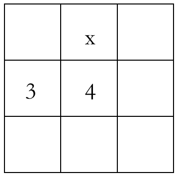

	解析: $2\quad6$

	右上角填5有3种，填6有2种，填7有1种，共6种。

##### 二、选择题

1. 如下图，用长方形纸作为侧面围成一个圆柱，围成的圆柱底面是(         )。(单位：cm)

	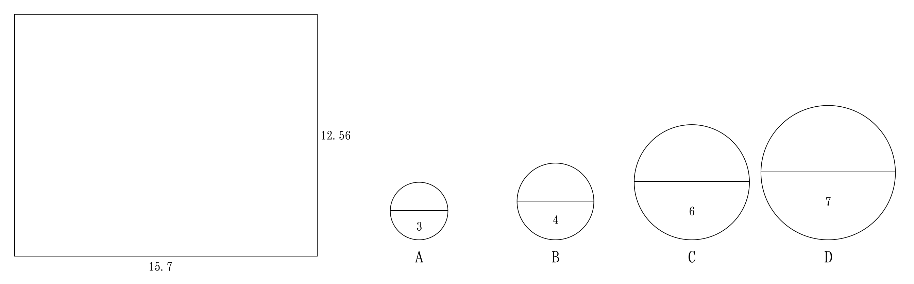

	解析: $B$

	第一种围法：$15.7\div\,3.14=5$，不存在该选项；第二种围法：$12.56\div\,3.14=4$，选B。

2. 在一个高是$30cm$的圆锥形容器里盛满水，把这些水倒入一个与它等底等高的圆柱形容器中，水的高度是(         )。

	A. $10cm$         	B. $30cm$         C. $90cm$         D. $20cm$

	解析: $A$

	${1\over\,3}S_底\times\,30=S_底\times\,h\Rightarrow\,h={1\over\,3}\times30=10(cm)$

3. 把$5:9$的后项加上18，要使比值不变，前项可以(         )。

	A. 加上$18$         B. 加上$15$         C. 乘$3$         D. 乘$2$

	解析: $C$

4. 讨论长方体的体积，底面积和高之间是否成正、反比时，下面(         )的说法是错误的。

    A. 因为高越大，长方体的体积就越大，所以长方体的体积和高成正例。

    B. 因为长方体的$体积\div高=底面积$，所以当长方体的底面积一定时，长方体的体积和高成正比例。

    C. 当长方体的体积一定时，长方体的底面积扩大到原来的2倍，高就缩小到原来的$1\over2$，所以当长方体的体积一定时，底面积和高成反比例。

    D. 长方体的体积和高是两个相关联的量，高变化，长方体的体积也随着变化，当长方体的体积和高的比值和高的比值(底面积)一定时，长方体的体积和高成正比例。

    解析: $A$

5. 下面各表中相对应的两个量不成正比例的是(         )。

	

	解析: $C$

6. 请你估计一下，(         )接近自己的年龄。

	A. 600分         B. 600周         C. 600时         D. 600月

	解析: $B$

7. 一根绳剪成两段，第一段长$3\over7$米，第二段占有全长的$3\over7$，那么(         )。

	A. 第一段长         B. 第二段长         C. 不能确定哪一段长

	解析: $A$

8. 种一批树，活了100棵，死了1棵，求成活率的正确算式是(         )。

	A.$\;{{100-1}\over100}\times100\%$         B.$\;{100\over{100+1}}\times100\%$         C.$\;100\over{100+1}$

	解析: $B$

9. 一根$60cm$的铁丝，长和宽按(         )的比例分配（长、宽都为整厘米数）围成的长方形面积最大。

	A. $4:1$         B. $2:1$         C. $3:2$

	解析: $C$

	==比值越小，面积越大，最大是正方形，比值为1，故选C==

10. 下图中，以直线为轴旋转一周，可以形成圆柱的是(         )。

    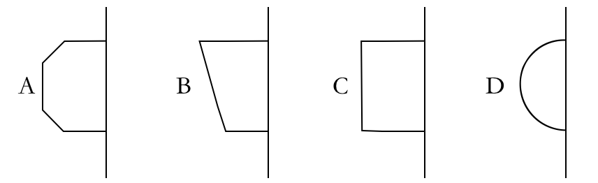

    解析: $C$

11. 和你跑步最接近的速度是(         )。

     A. 0.75米/秒         B. 7.5米/秒         C. 7.5米/分

     解析: $B$

     ==小学生50米8.4为优秀，那么算下来是5.9m\s，达到7.5m/s是运动健将了！！==

12. 小华双休日想帮妈妈做下面的事情：用全自动洗衣机洗衣服要用20分，扫地要用6分，擦家具要用10分，晾衣服要用5分。她经过合理安排，做完这些事情至少要花(         )分。

     A. 21         B. 25         C. 26         D. 30

     解析: $B$

     ==合理安排时间很重要！==

13.  一个圆柱与一个圆锥等底等高，圆柱的体积比圆锥的体积多(         )。

     A.$\,{2\over3}\quad\quad$B.$\,{1\over3}\quad\quad$C.$\,{2倍}\quad\quad$D.$\,{1\over2}$

     解析: $C$

     ==$V_柱=3V锥=V_锥(1+x) ；\quad\,x=2；故选C$==

14. 两组对边分别平行的四边形是(         )。

     A. 正方形         B. 长方形         C. 平行四边形

     解析: $C$

     ==平等四边形两组对边平行且相等==

15. 1，2，3，5都是30的(         )。

     A. 质数         B. 质因数         C. 约数

     解析: $C$

     ==注意 “1”不是质数==

16. 把一个平等四边形任意分割成两个梯形，这两个梯形(         )总是相等。

     A. 高         B. 上下两底的和         C. 周长         D. 面积

     解析: $A$

     ==排除法，“高”肯定相等，其余不用看了，要控制做题的时间！==

17. 最简分数的分子和分母(         )。

     A. 只有公约数1         B. 都是质数         C. 没有公约数

     解析: $A$

     ==“1”不是质数，且是任意数的约数==

18. 在${b\over\,a}\div{d\over\,c}$式子中，不能为0的数只能是(         )。

     A. $a,c$         B. $a,c,d$         C. $a,b,c,d$

     解析: $B$

     ==要使式子成立，首先$a,c$不为0(分母)，其次除数$d\over\,c$的倒数要有意义，即$c\over\,d$存在，所以$d$也不为0.==

19. 在含盐$30\%$的盐水中，加入6克盐14克水，这时盐水含盐百分比是(         )。

     A. 等于$30\%$         B. 小于$30\%$         C. 大于$30\%$

     解析: $A$

     ==加入的盐水尝试$6\div\,(6+14)\times\,100\%=30\%，所以不改变原盐水的浓度，选A$==

20. 若甲数的$1\over\,3$等于乙数的3倍，那么甲数(         )乙数。

     A. $ > $         B. $ = $         C. $ < $

     解析: $A$

     ==${1\over\,3}\times甲=3\times\,乙；即\quad\,甲=9\times\,乙，选A$==

21. 圆面积扩大16倍，则周长随着扩大(         )。

     A. $16$倍         B. $32$倍         C. $4$倍

     解析: $C$

22. 甲有图书$130$本，乙有图书$70$本，乙给甲(         )后，甲与乙的本数之比是$4:1$。

     A. $20$本         B. $30$本         C. $40$本

     解析: $B$

     ==$70-200\times\,{1\over\,5}=30，选B$==

23. 任意54个连续自然数的和是(         )。

     A. 奇数         B. 偶数         C. 可能是奇数，可能是偶数 

     解析: $A$

     ==$a_{54}=a_1+(54-1)\times\,1;\quad\,S_{54}={{(a_1+a_54)\times\,54}\over\,2}=27\times\,2a_1$（结果为偶数）$+27\times\,53$（结果为奇数）;$\quad$可以得出结果为一个偶数加一个奇数，结果仍然为奇数。==

24. 100以内，能同时被3和5整除的最大奇数是(         )。

     A. 75         B. 85         C. 90         D. 95 

     解析: $A$

     ==看清题目条件==

25. 下列说法正确的是(         )。

     A. 一条射线长12厘米         B. 角的大小与边的长短有关系 

     C. 等腰三角形一定是锐角三角形         D. 圆的周长和它的直径成正比例

     解析: $D$

     ==$C=\pi d;\; {C\over\,d}=\pi，所以选D$==

26. 已知$a\times\,{5\over\,3}=b\div\,62.5\%=c\times\,{3\over\,4}$ ($a、b、c$均不为$0$)，$a、b、c$这三个数中最小的是(         )。

     A. a          B. b          C. c         D. 无法判断

     解析: $A$

     ==$首先，c最大；62.5\%={5\over8};\;然后分析a,b。由a\times{5\over\,}=b\div\,{5\over8}\Rightarrow{b\over\,a}={24\over\,25}，\therefore\,a\,<\,b，故选A$==

27. 如果两个两位数的差是30，下面哪种说法有可能是对(         )。

     A. 这两个数的和是57          B. 这两个数的四个数字之和是19 	C. 这两个数的四个数字之和是14

     解析: $B$

     ==个位数相同，十位数差为3，设为 AC与BC，四个数字之和为A+B+2C=3+2B+2C，结果看3的奇偶性。==

28. 在长2米，宽1.4米的长方形三夹板上，能裁出(         )个半径为20厘米的圆。

     A. 20         B. 17         C 15

     解析: $C$

29. 已知每个人做某项工作的工作效率相同，$m$个人做$d$天可以完成，若增加$r$人，则完成工作所需要的天数为(         )。

     A.$\,{d+r}\quad\quad$B.$\,{d-r}\quad\quad$C.$\,{{md}\over{m+r}}\quad\quad$D.$\,{d\over{m+r}}\quad$

     解析: $C$

     ==每个人的工作效率是${1\over\,md},{m+r}人的工作效率就是{{m+r}\over\,{md}}，完成全部工作需要的天数即为{1\div\,{{m+r}\over\,md}}={md\over\,{m+r}}$，故选C==

30. 在一条线段中间另有6个点，则这8个点可以构成(         )条线段。

     A. 21         B. 28         C. 36         D.9

     解析: $B$

     根据组合公式:${C^2_8}={8!\over2!(8-2)!}={{8\times7}\over{2\times1}}=28$

31. 从A城到B城，甲车要10小时，乙车要8小时，甲车比乙车(         )。

     A.$\,慢25\%\quad\quad$B.$\,快25\%\quad\quad$C.$\,慢20\%\quad\quad$D.$\,快20\%$

     解析: $C$

     $V_甲=V_乙\times(1-x)=>{1\over10}={1\over8}\times(1-x)=>x=20\%$

32. 按下面的程序计算，若开始输入的值$x$是比零大的数，最后输出的结果为656，则满足条件的$x$的不同值最多有(         )。

	```mermaid
	
	graph LR
	
	A[输入x]--->B[计算5x+1的值]--->C{>500}--->|是|D[输出结果]
	
	style D stroke-width:0px,fill:#fff
	
	C--->|否|B
	
	```

	A. 2个         B. 3个         C. 4个         D. 5个

	解析: $C$
	
	$\begin{align*}&本题为递归计算，将小于500的值返回迭代为x，直到返为131.则可分为\\&1）5x+1=656=>x=131\\&2）5x+1=131=>x=26\\&3）5x+1=26=>x=5\\&4）5x+1=5=>x=0.8\end{align*}$

	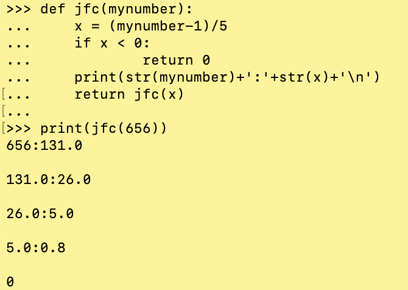

33. 一项工程，计划5小时完成，实际4小时就完成了任务，工作效率提高了(         )。

	A.$\,{1\over20}\quad\quad$B.$\,{1\over5}\quad\quad$C.$\,{1\over4}\quad\uqad$D.$\,不确定$

	解析: $C$

	${1\over4}={1\over5}\times(1+x)=>x={1\over4}$

34. 在一条长3600m的公路边，从一端开始等距竖立电线杆，每隔40m原已挖好了一个坑，现改为每隔60m立一根电线杆，则需要重新挖坑和填坑的个数分别是(         )。

	A. 50和40         B. 40和50         C. 60和30         D. 30和60

	解析: $D$

	在原基础上每3个坑为一组，需要挖1个，填2个。$挖：3600\div40\times{1\over3}=30，填：3600\div40\times{2\over3}=60$

35. 某种细胞开始有2个，1小时后分裂成4个并死去1个，2小时后分裂成6个并死去1个，3小时后分裂成10个并死去1个，按此规律，5小时后细胞存活的个数是(         )。

	A. 31         B. 33         C. 35        D. 37

	解析: $B$

	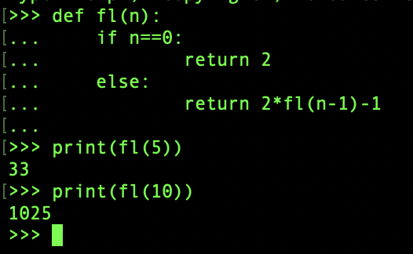

36. 甲数的${3\over7}$等于乙数的${3\over4}$，甲数和乙数的比是(         )。

	A. ${4\over3}:{3\over7}$         B. ${3\over7}:{3\over4}$         C. $7:4$         D. $4:7$

	解析: $C$

	${3\over7}甲数={3\over4}乙数=>甲数:乙数={3\over4}:{3\over7}=7:4，根据乘积相等构造比例。$

##### 三、判断题

1. 真分数除以假分数的商一定比1小。	(         )

	解析: &check;

	==分母>分子，分数值小于1==

2. 要清楚地反映出一只股票的涨跌变化情况，应选用条形统计图。	(         )

	解析: &cross;

	==折线图(曲线)==

3. 一个数的最大因数和最小倍数的积是这个数的平方。	(         )

	解析: &check; 

	==一个数的最大因数和最小倍数是本身。==

4. 2013年2月29日，小明在家开生日宴会。	(         )

	解析: &cross;

	==2013年不是润年，没有2月29日==

5. $10\over\,15$不能化成有限小数。	(         )

	解析: &check; 

	==最简分数的分母不含2、5之外的质因数则可以化成有限小数，否则不能==

6. 去掉小数点后面的零，小数的大小不变。	(         )

	解析: &cross;

	==小数点后面<u>末尾</u>的零不改变小数的大小==

7. 把12.297精确到百分位是12.3。	(         )

	解析: &cross;

	==12.30==

8. 数5和5.0的计数单位相同且大小相等。	(         )

	解析: &cross;

	==计数单位分别为1和00.1==

9. 一个分数的分子扩大4倍，分母缩小2倍，这个数的值就扩大8倍。	(         )

	解析: &check; 

10. 如果$a>b>0$，那么${b\over\,ab}$一定小于${a\over\,ab}$。	(         )

	解析: &check; 

    ==通分原理，a>b>0，${a\over\,ab}>{b\over\,ab}$==

11. 圆的直径与面积成正比例。	(         )

	解析: &cross;

    ==${S\over\,d^2}={1\over\,4}\pi,面积与直径的平方成正比$==

12. 1的倒数是1，0的倒数是0。	(         )

	解析: &cross;

    ==0没有倒数==

13. 圆柱体的体积与圆锥体的体积比是$3:1$。	(         )

	解析: &cross;

    ==定义要清析，需要限定条件：等底等高的圆柱和圆锥才有3:1的关系==

14. 一个自然数和它的倒数成反比例。	(         )

	解析: &check; 

    ==0没有倒数，看题要仔细==

15. 已知自然数$a$只有两个约数，那么$5a$最多有3个约数。	(         )

	解析: &cross;

    ==约数有4个，分别是(1,5,a,5a)==

16. 有一个最简人数，分子、分母的积是36，这个分数最大是$4\over\,9$。	(         )

	解析: &cross;

    ==没有说真分数，${9\over\,4}才都大$==

17. 梯形上底和下底不变，它的面积与高成正比例。	(         )

	解析: &check;

18. 自然数$a$经过四舍五入得到近似数3.142，那么$a$的聚会范围是$3.1415\leq\,a\leq\,3.1424$。	(         )

	解析: &cross;

	自然数不包括小数。

##### 四、口算题

1. $7万 + 13万 =$

	解析: $20万$

2. $\frac 34 + {5\over\,12} =$

	解析: $1{1\over\,6}$

3. ${1\over2}\div{1\over2}+2\div{1\over2}=$

	解析: $5$

4. $4.8\div0.8=$

	解析: $6$

5. $24\times{3\over4}=$

	解析: $18$

6. $12\times({1\over4}+{1\over6})=$

	解析: $5$

7. $3260\div48\approx$

	解析: $65$

8. $28\times\,42\approx$

	解析: $1120到1260都对$

##### 五、解方程

1. $x-{15\over4}=6.25$

	

	解析: $x=10$

2. $0.8\times(x-0.4)=8$

	

	解析: $x=10.4$

3. ${2\over3}\div\,{5\over6}=x\div9$

	

	解析: $x=7.2$

4. ${1\over6}x+{1\over5}x-{1\over2}=5$

	

	解析: $x=15$

5. $2x-{4\over\,5}x=1.2$

	

	解析: $x=1$

6. ${{2x+1}\over12}=1-{{3x-2}\over4}$

	

	解析: $x={11\over17}$

	$$
	\begin{align*}
	&解：2x+1=12-3\times(3x-2)\\
	&\quad\quad2x+1=12-9x+6\\
	&\quad\quad11x=17\\
	&\quad\quad\;\;x={11\over17}
	\end{align*}
	$$

7. ${{3x+1}\over2}-1={{x+2}\over5}$

	

	解析: $x={9\over13}$

	$$
	\begin{align*}
	&解：15x+5-10=2x+4\\
	&\quad\quad13x=9\\
	&\quad\quad\,x={9\over13}
	\end{align*}
	$$

8. ${1\over2}x+1=x-{1\over3}$

	

	解析: $x={8\over3}$

	$$
	\begin{align*}
	&解：3x+6=6x-2\\
	&\quad\quad3x=8\\
	&\quad\quad\,x={8\over3}
	\end{align*}
	$$

##### 六、脱式计算

1. $3.15\times23-1.15\times23$

	

	解析: $46$

2. $\frac 35\times\,\frac 23 +\frac 56\div\frac 13$

	

	解析: $2.9$

3. $({5\over8}+{1\over27})\times8+{19\over27}$

	

	解析: $6$

4. $1042-384\div\,16\times\,13$

	

	解析: $730$

5. ${2\over3}-{3\over4}\times{4\over11}+{1\over3}\div{3\over7}$

	

	解析: $1{17\over\,99}$

6. $12\times[({11\over\,6}-{2\over\,3})\times\,3]$

	

	解析: $42$

7. $1\div\,({4\frac 17}-0.05\times\,70)\times\,{1\frac 27}$

	

	解析: $2$

8. $(1{8\over\,13}\times\,{13\over\,42}+{2\over\,3})\div\,(11-1{\frac 23})$

	

	解析: ${5\over\,56}$

9. ${1\over2}+{1\over4}+{1\over8}+{1\over16}+{1\over32}+{1\over64}+{1\over128}$

	

	解析: ${127\over\,128}\,在式末加{1\over\,128},\,再减{1\over\,128}$

10. ${3\over4}\times{2\over5}\div{3\over4}\times{2\over5}$

	

	解析: ${4\over\,25}$

11. $20{5\over\,13}-2.73-8.27+1{7\over\,13}$

	

	解析: $10{12\over\,13}$

12. $[2{4\over\,9}\div\,(3{2\over\,5}-{11\over\,15})\times\,1{1\over\,11}]\div\,4.02$

	

	解析: ${50\over\,201}$

13. $[2{7\over\,10}+(3.4-2{2\over\,3})\times\,4.5]\div\,1{7\over\,15}$

	

	解析: $4{1\over\,11}$

14. $432\times\,99-568$

	

	解析: $42200$

15. $1{4\over\,17}\times\,(2{2\over\,3}-0.75)+15{1\over\,2}\div\,{17\over\,21}$

	

	解析: $21{35\over\,68}$

16. $3{3\over\,8}\times\,9-3-0.375=$

	

	解析: $27$

17. $999\times\,222+333\times\,334$

	

	解析: $333000$

18. $12{1\over\,4}-(3{2\over\,5}+2.25-3.6)$

	

	解析: $10.2$

19. $[19+19\times\,(1.9-1{9\over\,10})\div\,0.95]\div\,0.38$

	

	解析: $50$

20. ${5\over\,{1\times\,6}}+{5\over{6\times\,11}}+{5\over\,{11\times\,16}}+{5\over{16\times\,21}}$

	

	解析: ${20\over\,21}$

	$$
	\begin{align*}
	&解：原式=1-{1\over6}+{11\over\,6\times11}-{6\over6\times11}+{16\over11\times16}-{11\over11\times16}+{21\over16\times21}-{16\over16\times21}\\
	&\quad\quad\quad\quad=1-{1\over\,6}+{1\over\,6}-{1\over11}+{1\over11}-{1\over16}+{1\over16}-{1\over21}\\
	&\quad\quad\quad\quad=1-{1\over21}\\
	&\quad\quad\quad\quad={20\over21}
	\end{align*}
	$$

21. ${1\over{1+2}}+{1\over{1+2+3}}+\cdots+{1\over{1+2+3+\cdots+19}}$

	

	解析: ${9\over10}$

	$$
	\begin{align*}
	&解：原式=2\times({1\over2\times3}+{1\over3\times4}+\cdots+{1\over19\times20})\\
	&\quad\quad\quad\quad=2\times({1\over2}-{1\over20})\\
	&\quad\quad\quad\quad=2\times{9\over20}\\
	&\quad\quad\quad\quad={9\over10}
	\end{align*}
	$$

22. ${9\over20}\div[({2\over3}+{4\over5})\times{1\over2}]$

	

	解析: ${27\over44}$

	$$
	\begin{align*}
	&解：原式={9\over20}\div({22\over15}\times{1\over2})\\
	&\quad\quad\quad\quad={9\over20}\times{15\over11}\\
	&\quad\quad\quad\quad={27\over44}
	\end{align*}
	$$

##### 七、应用题

1. 《镜花缘》是清代李汝珍创作的长篇小说，书中出现了一些有趣的数学现象。下面的题目是根据其中的一个问题改编的，你能解决吗？

	楼上灯有两种，甲种灯下一个大球，下缀两个小球，乙种灯下一个大球，下缀四个小球。大球共三十六个，小球共一百二十个。甲、乙两种灯各有多少盏？

	

	解析: 参考方法

	$$
	\begin{align*}
	&解：设甲种灯为x盏，那么乙种灯为(36-x)盏，根据小球总数为120个列方程\\
	&2x+4\times\,(36-x)=120\\
	&x=12\\
	&36-x=36-12=24\\
	&答：甲种灯有12盏，乙种灯有24盏。
	\end{align*}
	$$

2. 一艘轮船从甲港开往乙港，平均每时行$45km$，$8$时到达，原路返回时，平均每时行$30km$，需要多少时到达甲港？（列方程解应用题）

	

	解析: 参考方法

	$$
	\begin{align*}
	&解：设从乙港返回甲港需要x小时，根据两港之间距离不变列方程\\
	&30x=48\times\,8\\
	&x=12.8\\
	&答：需要12.8小时。
	\end{align*}
	$$

3. 一个底面积是$37.68m^2$的圆柱形蓄水池，它的容积是$30.144m^3$。如果想要扩大容积，让其能装$56.52m^3$的水，那么至少还要挖多少米？

	

	解析: 参考方法

	$$
	\begin{align*}
	&解：(56.52-30.144)\div37.68=0.7\\
	&答：至少还要挖0.7m。
	\end{align*}
	$$

4. 一个电饭锅的内胆是圆柱形的，从里面量，它的直径是$24cm$，高是$20cm$。用这个电饭锅做饭，做熟的米饭占内胆的$\frac 34$，求做熟的米饭的体积。

	

	解析: 参考方法

	$$
	&\begin{align*}
	&解：3.14\times\,(24\times\,{1\over\,2})^2\times\,20\times\,{3\over\,4}=6782.4\\
	&答：做熟的米饭体积是6782.4cm^3.
	\end{align*}
	$$

5. 甲乙两港间的水路长208千米，一只船从甲港开往乙港，顺水8小时到达，从乙港返回甲港，逆水13小时到达，求船在静水中的速度和水流速度。

	

	解析: 参考方法

	$$
	\begin{align*}
	&解：设船在静水中的速度是v_船，水流速度是v_水，列方程\\
	&\begin{cases}
	&v_船+v_水=208\div\,8\quad\,\;\,1)\\
	&v_船-v_水=208\div\,13\quad\,2)\\
	&\end{cases}\\ 
	&\begin{cases}
	&v_船=21km/h\\
	&v_水=5km/h\end{cases}\\
	&答：船在静水中的速度是21km/h，水流的速度是5km/h。
	\end{align*}
	$$

6. 直角三角形$ABC$，其中$AB长5cm$，$AC长3cm$，$BC长4cm$，将它的直角边$AC$对折到斜边$AB$上，使$AC$与$AB$重合，如下图，则未重叠部分的面积是多少cm^2^？

	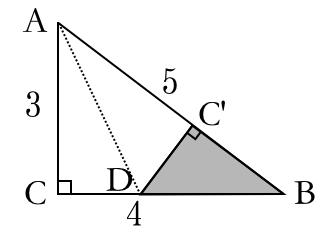


	解析: 参考方法
	
	$$
	\begin{align*}
	&解：\because AC'=AC=3,BC'=2,S_{BC'D}:S_{AC'D}=2:3\\
	&\therefore\,S_{BC'D}:S_{ABC}=2:(2+3+3)=2:8\\ 
	&又\because\quad\,S_{ABC}={1\over2}\times\,3\times\,4=6\\
	&\therefore\,S_{BC'D}=6\times\,{2\over\,8}=1.5(cm^2)\\
	&答：阴影部分的面积是1.5cm^2
	\end{align*}
	$$

7. 双语小学综合实践活动基地种了三种果树。梨树占总数的$1\over3$，与苹果树的和是$240$棵，苹果树与其他两种树棵数的比是$1:5$。这三种树共有多少棵？

	

	解析: 参考方法

	$$
	\begin{align*}
	&解：设总共有x棵树。\\
	&240-{1\over\,3}x={1\over\,{1+5}}x\\
	&x=480\\
	&答：这三种树共有480棵。
	\end{align*}
	$$

8. 一个圆柱形酸奶桶，底面内直径是$16$厘米，高$25$厘米，它的容积是多少升？ 把这桶酸奶分别装在底面直径是$10$厘米，高20厘米的圆柱形玻璃杯中，需要多少个这样的玻璃杯？

	

	解析: 参考方法

	$$
	\begin{align*}
	&解：容积是\quad\,3.14\times\,(16\times\,{1\over\,2})^2\times\,25=5024(cm^3)=5.024(L)\\
	&5024\div\,[3.14\times\,(10\times\,{1\over\,2})^2\times\,20]=3.2\\
	&\because杯子要取整数\\ 
	&\therefore需要4个玻璃杯。\\
	&答：需要4个这样的玻璃杯。
	\end{align*}
	$$

9. 如图，父子两人同是从$A$点出发，沿着长方形$ABCD$的操场背向而行，儿子的速度是父亲的$11\over14$，不久，两人在跟$C$点$6$米的$E$处相遇，求长方形操场的周长。

	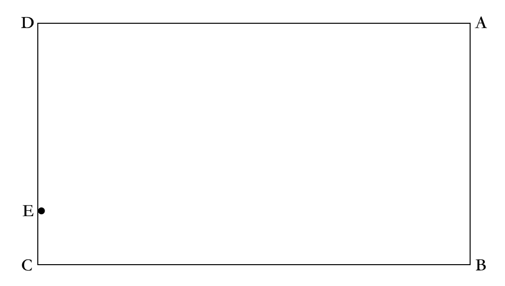


	解析: 参考方法
	
	$$
	\begin{align*}
	&解：设父亲走了x米，他们相遇时儿子走了{11\over14}x，可以得出长方形操场的周长是x+{11\over\,14}x={25\over14}x,\\
	&由图得知，父亲比儿子多走的路程是6\times\,2=12(米)，列方程得\\
	&x-{11\over\,14}x=6\times\,2\\ 
	&x=56米\\
	&操场周长为：{25\over\,14}\times\,56=100(米)\\
	&答：长方形操场的周长是100米。
	\end{align*}
	$$

10. 求阴影部分的面积。（单位：厘米）

	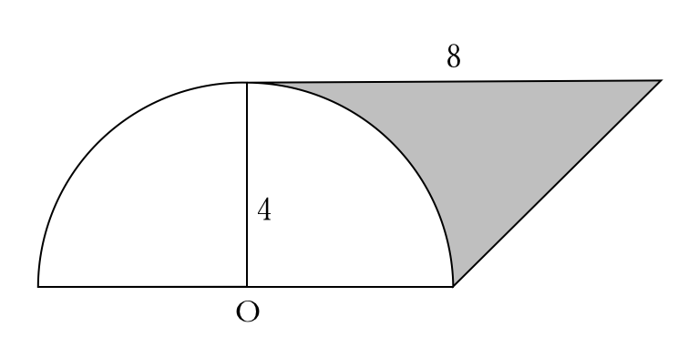

	解析: 参考方法

	$$
	\begin{align*}
	&解：\quad取\pi=3.14，S_{阴影}={1\over\,2}\times(8+4)\times\,4-{1\over\,4}\times\,4^2\\
	&=11.44cm^2\\
	&答：阴影面积是11.44cm^2
	\end{align*}
	$$

	

11. 长方形$ABCD$面积为48，E，F为中点，求图中阴影部分的面积。

    

    解析: 参考方法

    $$
    \begin{align*}
    &解：连接GF，过F点作BC垂线交EC于O，S_{BDF}={1\over\,4}\times\,48=12\\
    &\because\,DE:BC=1:2=DG:BG\\
    &\therefore\,S_{DGF}={1\over\,3}\times\,12=4\\
    &\because\,FO:DE=1:2;\; DE:BC=1:2\\ 
    &\therefore\,FO:BC=1:4=FH:BH\\
    &因此，S_{FGH}={1\over\,5}\times12\times{2\over\,3}=1.6\\
    &S_{阴影}=S_{DFG}+S_{FGH}=4+1.6=5.6\\
    &答：图中阴影部分的面积是5.6
    \end{align*}
    $$

12. 实验小学六年级有女生120人，比男生的${2\over3}$少24人。实验小学学生共有多少人？ (列方程解应用题)

    

    解析: 参考方法

    $$
    \begin{align*}
    &解：设男生有x人。列方程\\ 
    &{2\over\,3}x-24=120\\
    &x=216\\
    &共有人数为\quad\,120+216=336(人)\\
    &答：实验小学学生检有336人。
    \end{align*}
    $$

13. 一个长方体玻璃鱼缸(鱼缸的上面没有玻璃)，长5分米，宽3分米，高3.5分米。制作这个鱼缸至少需要多少平方分米的玻璃？

	

	解析: 参考方法

	$$
	\begin{align*}
	&解：(5+3)\times\,2\times\,3.5+5\times\,3=71(平方分米)\\
	&答：至少需要71平方分米的玻璃\quad\,\quad
	\end{align*}
	$$

14. 一个底面半径是6厘米的圆柱形玻璃器皿里装有一部分水，其中浸没着一个高9厘米的圆锥体铅锤。当铅锤从水中取出后，水面下降了0.5厘米。这个圆锥体的底面积是多少平方厘米？（$\pi$取3.14）

	

	解析: 参考方法

	$$
	\begin{align*}
	&解：3.14\times\,6^2\times\,0.5\div\,({1\over\,3}\times\,9)\\
	&=18.84(平方厘米)\\
	&答：这个圆锥的底面积是18.84平方厘米。
	\end{align*}
	$$

15. 一辆客车从甲地开往乙地，每小时行驶75千米，预计3小时到达，行了1小时，机器发生故障，就地维修了20分钟，要想准时到达而不误事，以后每小时应加快多少千米？

	

	解析: 参考方法

	$$
	\begin{align*}
	&解：(75\times\,3-75\times\,1)\div\,1{2\over\,3}-75=15(千米)\\
	&答：以后每小时应该加快15千米。
	\end{align*}
	$$

16. 甲乙两仓库的货物重量比是$7:8$，如果从乙仓库运出$1\over\,4$，甲仓库运进6吨，那么甲仓库比乙仓库多$14$吨，求：甲乙两仓库原有货物有多少吨？

	

	解析: 参考方法

	$$
	\begin{align*}
	&解：设乙仓库原有货物x吨，则甲仓库有货物{7\over\,8}x吨，可列方程\\
	&({7\over\,8}x+6)-(1-{1\over\,4})x=14\\
	&解这个方程\quad\,x=64\\
	&\therefore\,甲有货物\;{7\over\,8}\times\,64=56(吨)\\
	&答：甲原有货物56吨，乙原有货物64吨。
	\end{align*}
	$$

17. 一块合金含铜与锌比为$3:4$，用此合金制造铜锌这比为1:2的新合金$63$克，问要加铜还是加锌，加多少克 ？

    

    解析: 参考方法

    $$
    \begin{align*}
    &解：原合金含铜量\;{3\over\,3+4}\times\,100\%=42.86\%;\;新合金含铜量\;{1\over\,1+2}\times\,100\%=33.3\%。\\
    &因为新合金含铜量降低了，所以加的是锌。\\ 
    &由上可知，铜的质量不变，其为\; 63\times\,{1\over\,1+2}=21(克)\\
    &用现在合金减去原来合金的质量，列式可计算加锌的质量。\\
    &63-21\div\,{3\over\,3+4}=14(克)\\
    &答：需要加锌14克。
    \end{align*}
    $$

18. 脱粒用的电动机的传动轮直径为0.16米，脱粒机的转动轮直径为0.24米，若电动机每分钟3600转，则脱粒机的转动轮每分钟多少转？

	

	解析: 参考方法

	$$
	\begin{align*}
	&解：设脱粒机的转动轮每分钟x转，可列方程。\\ 
	&3.14\times\,0.24\times\,x=3.14\times\,0.16\times\,3600\\
	&x=2400\\
	&答：脱粒机转动轮每分种2400转。
	\end{align*}
	$$

19. 某校学生举行春游，若租用45座客车，则有15人没有座位，若租用同样数目的60座客车，则一辆客车空车。已知45座客车租金220元，60座客车租金300元。问：

     $1)\quad$个学校一共有学生多少人？

     $2)\quad$怎样租车最经济合算？

    

    解析: 参考方法

    $$
    \begin{align*}
    &解：设租用x辆车，可列方程\\
    &45x+15=(x-1)\times\,60\\
    &x=5\\
    &总人数为\quad\,4\times\,60=240(人)\\
    &租45座客车费用：220\times5=1100(元)\\
    &租60座客车费用：300\times\,4=1200\\
    &答：因为\,1100<1200\,，所以租5辆45座客车最经济合算。
    \end{align*}
    $$

20. 有黑白棋子一堆，黑子颗数是白子的2倍，从堆中每次取出黑子4颗，白子3颗，待取了若干次后，白子取尽而黑子还有32颗，这堆棋子共有多少颗？（列方程解）

	

	解析: 参考方法

	$$
	\begin{align*}
	&解：设一共取了x次，列方程得\\
	&4x+32=2\times3x\\
	&解这个方程:\,x=16\\
	&共有棋子:\,16\times7+32=144(颗)\\
	&答：这堆棋子共有144颗，其中黑子96颗，白子48颗。
	\end{align*}
	$$

21. 甲乙两台抽水机排出井内积水，在工作过程中，每小时向井内流入现在井水的$1\over\,20$，如果不向井内流水，排净井内积水需要的时间，甲机独抽需要10小时，乙机独抽时间需要15小时，如果两机同时开始工作，需要几小时将井内水和流入的水全部抽干？

	

	解析: 参考方法

	$$
	\begin{align*}
	&解：设需要x小时将井内水和流入的水抽干，根据题意列方程\\
	&({1\over\,10}+{1\over\,15})x=1+{1\over\,20}x\\
	&解这个方程:\quad\,x=8{4\over\,7}(时)\\
    &答：8{4\over\,7}小时可以将进水和流入的水全部抽干。
	\end{align*}
	$$

22. 把一个底面半径为5厘米，长为2米的圆柱，熔铸成一个底面直径是8分米的圆锥，圆锥有多高？

	

	解析: 参考方法

	$$
	\begin{align*}
	&解：5cm=0.5dm;\;2m=20dm\\ 
    &\pi\times\,2.5^2\times\,20\div({1\over\,3}\pi\times\,4^2)={15\over\,16}\\
    &答：圆锥高度是{15\over\,16}dm。
	\end{align*}
	$$

	==$$化为小数结果为0.9375dm，用厘米计算结果为9.375或9{3\over\,8}也可以$$==

23. 小红妈妈得到年终奖$25000$元，将其中的$80\%$ 购买国库券，年利率是$3.14\%$ ，五年后全部取出共得多少元？

	

	解析: 参考方法

	$$
	\begin{align*}
	&解：2500\times80\%\times(1+5\times3.14\%)=23140(元)\\
    &答：五年后全部取出共得23140元。
	\end{align*}
	$$

24. 仓库有一批货物，运走的货物与剩下的货物的质量比是$2:7$，如果又运走$64$吨，那第剩下的货物只有仓库原有货物的$3\over5$，仓库原有货物多少吨？

	

	解析: 参考方法

	$$
	\begin{align*}
	&解：64\div\,({7\over\,2+7}-{3\over\,5})=64\div\,{8\over\,45}=360(吨)\\
	&答：仓库原有货物360吨。
	\end{align*}
	$$

25. 某市出租车收费标准如下。小理现有24.4元，他乘出租车最多能行多远？

	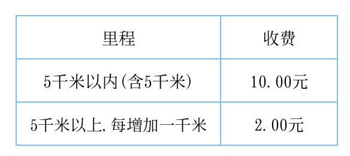

	解析: 参考方法

	$$
	\begin{align*}
	&解：(24.4-10)\div\,2+5=12.2(千米)\\
	&答：他乘车最多能走12.2千米。
	\end{align*}
	$$

26. 把一块长$10$厘米、宽$8$厘米、高$3.14$厘米的长方体铁块完全浸没在一个盛有水的圆柱形玻璃容器内，已知容器的底面直径为$20$厘米，容器内的水面会上升多少？(已知水不会溢出)

	

	解析: 参考方法

	$$
	\begin{align*}
	&解：3.14\times\,8\times\,10\div[3.14\times(20\div\,2)^2]=0.8(cm)\\
	&容器内水会升高0.8cm。
	\end{align*}
	$$

27. 王佳期中考试语文、数学、英语、物理、化学五门功课总分是448分，已知前三门平均91分，后三门平均88分，王佳英语考了多少分？

	

	解析: 参考方法

	$$
	\begin{align*}
	&解：91\times\,3+88\times\,3-448=89(分)\\
	&答：王佳英语得了89分。
	\end{align*}
	$$

28. 兄弟两人早晨7时同时从家里出发去上学，兄每分钟走100米，弟每分钟走60米，兄到了学校休息了5分钟才发现英语书没带，立即回家，途中7时25分与弟相遇，学校离家有多远？

	

	解析: 参考方法

	$$
	\begin{align*}
	&解：[25\times\,60+(25-5)\times\,100]\div\,2=1750(米)\\
	&答：学校距家1750米。
	\end{align*}
	$$

29. 有15吨苹果要运到交易市场，租一辆4吨货车需运费500元，租一辆1吨货车需运费200元。货运公司提供了设计好的三种方案：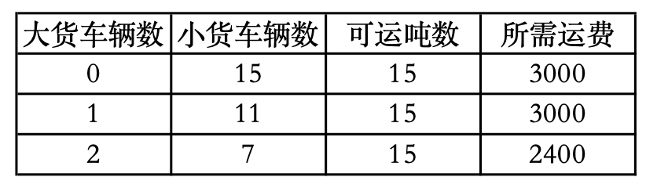

     你还能提出比货运公司更少钱的方案吗？ 如果能，请帮忙算回来。

	

	解析: 参考方法

	$$
	\begin{align*}
	&解：更好的方案是全部租有4辆大货车，所需费用为\\
	&{4\times500=2000}(元)\\
	&答：最省钱的方式是全部租用大货车，共需4辆。
	\end{align*}
	$$

30. 学校卫生室把四年级学生平均分成四批检查视力，第一批和第三批视力全部正常，第二批学生中$90\%$视力正常，第四批学生中有${1\over\,12}$视力不正常。已知四年级学生中视力正常的共$229$人，视力不正常的有多少人？

	

	解析: 参考方法

	$$
	\begin{align*}
	&解：设共有x人，根据题意列方程得\\
	&{1\over\,4}x+{1\over\,4}x+90\%\times{1\over\,4}x+{11\over\,12}\times\,{1\over\,4}x=229\\
	&解这个方程得：\quad\,x=240(人)\\
	&视力不正常人数：240-229=11(人)\\
	&答：视力不正的有11人。
	\end{align*}
	$$

31. 操作上有$108$名同学在锻炼身体，其中女生占${2\over\,9}$，后来又来了几名女生，使女生人数和男生人数的比是$3:7$，后来来了几名女生？

	

	解析: 参考方法

	$$
	\begin{align*}
	&解：设来了x名女生，男生的数量没有改变，根据题意列方程得\\
	&(108+x)\times\,{7\over\,3+7}=108\times\,(1-{2\over\,9})\\
	&解这个方程得：x=12\\
	&答：后来来了12名女生。
	\end{align*}
	$$


32. 甲乙两班人数相等，各有一些同学参加数学课外小组。甲班参加的人数恰好是乙班没参加的$1\over\,4$，乙班参加的人数恰好是甲班没参加人数的$1\over\,5$，甲班没参加人数是乙班没参加人数的几分之几？（先画线段图，再列式解答）

    

    解析: 参考方法

    $$
    \begin{align*}
    &解：设甲未参加人数为x，乙未参加人数为y，由图可列方程\\
    &{1\over\,4}y+x=y+{1\over\,5}x\\
    &解这个方程：x:y=15:16 (即：x={15\over\,16}y)\\
    &答：甲班没参数加人是乙班没参加人数的{15\over\,16}。
    \end{align*}
    $$

33. 四川地震形成的一个堰塞湖经过测量20天后水位将达到坝的顶端，为了延长时间转移下游群众，开辟了一个泄洪渠道向外排水，这样可使水位到达坝顶推迟到30天，那么每天泄出水量是流入湖中水量的几分之几？

    

    解析: 参考方法

    $$
    \begin{align*}
    &解：设每天泄水量是流入水量的x。列方程得\\
    &{1\over\,20}-{1\over\,20}x={1\over\,30}\\
    &解这个方程：x={1\over\,3}\\
    &答：每天泄出水量是流入湖中水量的{1\over\,3}。
    \end{align*}
    $$

34. 一个圆柱体容器的底部放着一块正方体铅块，现在打开水龙头向容器内注水，15秒种时恰好沿过铅块，又过了1分半中，水注满了容器。若容器的高度是24厘米，铅块高度是6厘米，则容器底面积是多少平方厘米？

    

    解析: 参考方法

    $$
    \begin{align*}
    &解：1分半=90秒；水龙头出水量固定，注入水的体积与时间成正比。\\
    &设前15秒注入的水体积为V_1；后90秒注入的水体积是V_2；容器的底面积为S_底\\
    &可知：V_1:V_2=15:90=1:6\\
    &又\because\quad\,V_1=(S_底-6\times\,6)\times\,6;\;V_2=S_底\times\,(24-6)\\
    &\therefore (S_底-6\times\,6)\times\,6:S_底\times\,(24-6)=1:6\\
    &解这个比例得：S_底=72(平方厘米)\\
    &答：容器的底面积是72平方厘米。
    \end{align*}
    $$

35. 现在父母年龄的和是他们几个子女年龄和的6倍，两年前父母年龄的和是他们几个子女年龄和的10倍，六年后父母年龄的和是他们几个子女年龄和的3倍。那么这两位父母应该有几个子女？现在父母年龄的和是多少岁？

    

    解析: 参考方法

    $$
    \begin{align*}
    &解：设现在父母的年龄和为x，子女的年龄和是y，一共有m个子女。根据题意列方程\\
    &\begin{cases}
    &x=6y;\quad\,\quad\,\quad\,\quad\quad\;\quad\quad\quad\quad\,1)\\
    &x-4=(y-2m)\times10;\quad\quad\quad\,2)\\
    &x+6\times2=(y+6m)\times3;\quad\quad3)
    &\end{cases}\\
    &解这个方程组得：\\
    &\begin{cases}
    &x=84;\\
    &y=14;\\
    &m=3\\
    &\end{cases}\\
    &答：一共有3个孩子，现在父母共84岁。\\
    \end{align*}
    $$

36. 求下面图形的侧面积和体积。

    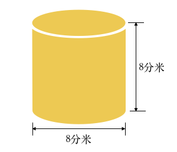

    解析: 参考方法

    $$
    \begin{align*}
    &解：S_侧=\pi\times\,8\times\,8=200.96(平方分米)\\
    &V_柱=\pi\times\,({8\over\,2})^2\times\,8=401.92(立方分米)\\
    &答：图中圆柱体的侧面积是200.96平方分米，体积是401.92立方分米。
    \end{align*}
    $$

37. 一铁路巡道工正在隧道中工作，突然听到一列火车向隧道驶来，他立即看隧道内的路标，知道他与火车驶来方向的那端隧道口间的距离为隧道全长的$3\over\,7$。凭他的经验，用最快的速度无论向哪一头跑，当火车到达他跟前时，都刚好离开隧道。如果火车速度为每小70千米，请问巡道工奔跑的速度是每小时多少千米？

    

    解析: 参考方法

    $$
    \begin{align*}
    &解：分析得出，当巡道工往回跑到距隧道口{1\over\,7}处时，火车刚好开始进隧道，\\ 
    &设巡道工的速度是每小时x千米，利用两者同时出隧道即时间相等可列方程：\\
    &(1-{3\over7}-{3\over\,7}):x=1:70\\
    &x=10\\ 
    &答：巡道工奔跑的速度是每小时10千米。
    \end{align*}
    $$

38. 新昌茶叶店运到一级茶叶和二级茶叶一批，其中二级茶叶数量是一级茶叶的$1\over\,2$。一级茶叶的买进价是$24.8$元，二级茶叶的买进价是$16$元。现照买进价加价$12.5\%$出售，当二级茶叶全部卖完，一级茶叶剩$1\over\,3$时，共盈力$460$元，那么运进的一级茶叶有多少千克？

    

    解析: 参考方法

    $$
    \begin{align*}
    &解：设运进的一级茶叶共有x千克，列方程得\\
    &\,[24.8\times\,(1-{1\over\,3})x+16\times{1\over\,2}x]\times\,12.5\%=460\\
    &x=150\\
    &答：运进的一级茶叶有150千克。
    \end{align*}
    $$

39. 如图，求如图中阴影部分的面积(精确到0.01，$\pi取3.14$)。

    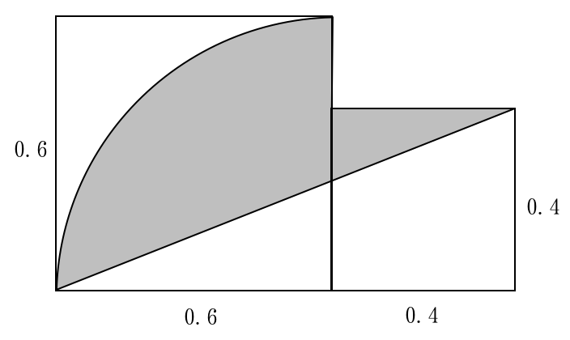

    解析: 参考方法

    $$
    \begin{align*}
    &解：S_{大扇形}+S_{正方形}-S_{三角形}\\
    &={1\over\,4}\times\,\pi\times\,0.6^2+0.4^2-{1\over\,2}\times\,(0.6+0.4)\times\,0.4\\
    &=0.09\pi+0.16-0.2\\
    &=0.2426\\
    &\approx0.24
    \end{align*}
    $$

40. 已知甲矿场有矿产30吨，乙矿场有矿产50吨，工地A需要35吨，工地B需要45吨，需要将甲、乙两个矿场的矿运往A、B两个工地，运费表如下表：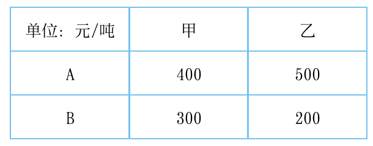

    $1)\quad假设甲场运往A地x吨，则总运费可用含x的代数式表示为$\_\_\_\_\_\_\_\_\_\_\_\_\_\_\_\_\_\_\_\_\_\_\_\_\_\_\_\_\_\_\_\_\_\_\_\_\_\_\_\_\_\_\_\_\_\_\_\_\_\_

    $2)\quad怎样安排能使得总运费最少，最少为多少元？$

    

    解析: 参考方法

    $$
    \begin{align*}
    &解：将第一问化简得：总运费是y=29500-200x，即(29500-y)与x成正比例\\
    &x取值的范围是0～30（甲矿场所有的矿产），当x=30时，(29500-y)取得最大值.\\
    &此时y的值最小，即运费最低:y_{min}=29500-200\times\,30=23500。\\
    &答：甲矿场的矿产全部运往A地，总运费最少，最少为23500元。
    \end{align*}
    $$

41. 如图，已知四边形ABCD和CEFG都是正方形，且正方形ABCD的边长为10厘米，那么图中阴影三角形BFD的面积为多少平方厘米？

    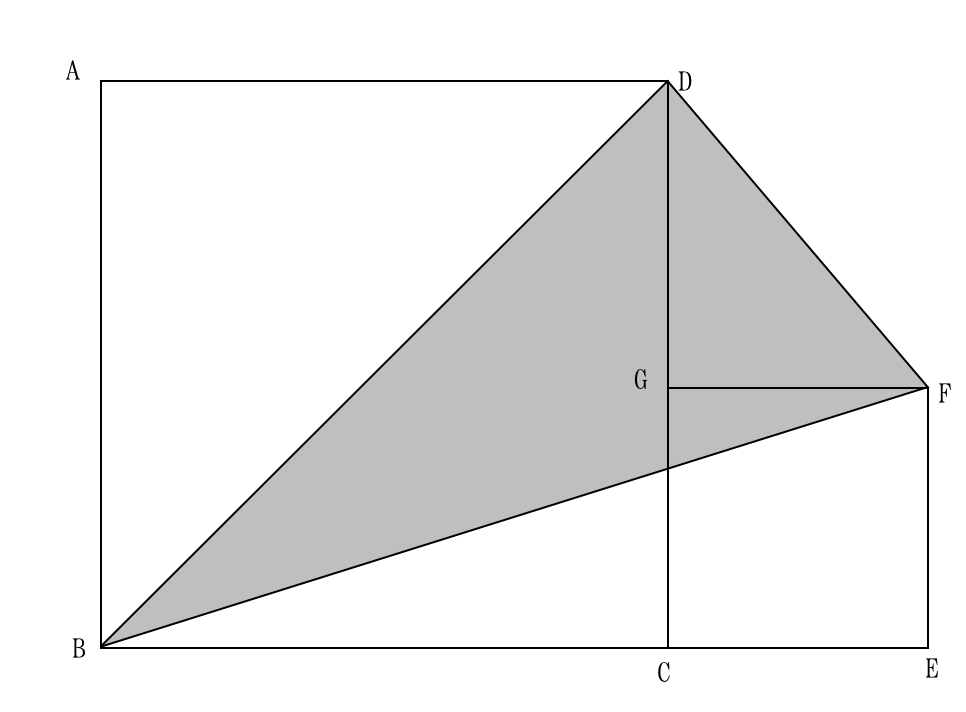

    解析: 参考方法

    $$
    \begin{align*}
    &解：连接CF可知CF//BD，平移F至C点.\\
    &S_BCD=S_BFD={1\over2}\times10\times10=50\\
    &答：图中阴影面积是50平方厘米。
    \end{align*}
    $$

42. 有一段钢可做一个底面直径8厘米，高9厘米的圆柱形零件。如果把它改制成高是12厘米的圆锥形零件，零件的半径是多少厘米？

    

    解析: 参考方法

    $$
    \begin{align*}
    &解：设零件的半径是r厘米，根据体积不变列方程。\\
    &{1\over3}\times\pi\times{r^2}\times12=\pi\times({8\over2})^2\times9\\
    &r=6\\
    &答：零件的半径是6厘米。
    \end{align*}
    $$

43. 一列火车通过一座1000米的大桥需要65秒，如果用同样的速度通过一座730米的隧道则需要50秒。求这列火车前进的速度和火车的长度。

    

    解析: 参考方法

    $$
    \begin{align*}
    &解：设火车的长度为x，利用速度相等列方程。\\
    &(1000+x)\div65=(730+x)\div50\\
    &x=170\\
    &火车长度：(730+170)\div50=18(米)\\
    &答：火车速度是170米/秒，火车长度是18米。
    \end{align*}
    $$

44. 下图为手的示意图，在各个手指间标记字母A，B，C，D，请你按照图中箭头所指方向（即A->B->C->D->C->B->A->B-> C->……的方式）从A开始数连续的正整数1，2，3，4，…

    1）当数到12时，对应的字母是\_\_\_\_\_\_\_\_\_；

    2）求当字母C第201次出现时，恰好数到的数是多少？

    3）当字母C每2n+1次出现时（n为正整数)，恰好数到的数是多少？（用含n的代数式表示）

    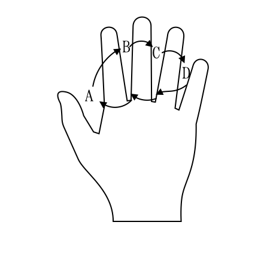

    解析: 参考方法

    $$
    \begin{align*}
    &解：\\
    &1）B\\
    &2）根据题意，按照A->B->C->D->C->B的方式循环，每次6个数，其中C出现2次。\\
    &\quad\,当C出现201次，先计算第200次时，循环次数为100，即6\times100=600;\\
    &\quad\,C排在第3位，所以为603\\
    &3）由上题可知：6n+3
    \end{align*}
    $$

45. 如图，求如图中阴影部分的面积。（$\pi$取3.14）

    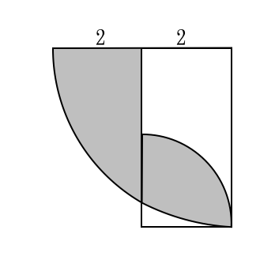

    解析: 参考方法

    

    $$
    \begin{align*}
    &解：阴影部分可以分为A、B两部分。\\
    &S_A={1\over4}\times\pi\times4^2-{2\times4}+S_C=4\pi-8+S_C\\
    &S_B={1\over4}\times\pi\times2^2-S_C=\pi-S_C\\
    &S_A+S_B=4\pi-8+S_C+\pi-S_C\\
    &S_A+S_B=5\pi-8=7.7
    \end{align*}
    $$

46. 如图，求图中的平面图形以AB为轴旋转一周后形成的立体图形的体积。（$\pi$取3.14）

    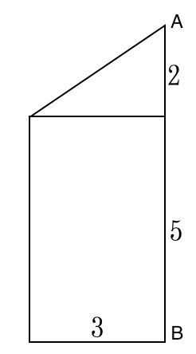

    解析: 参考方法

    $$
    \begin{align*}
    &解：V=V_柱+V_锥\\
    &=\pi\times3^2\times5+{1\over3}\pi\times3^2\times2\\
    &=45\pi+6\pi\\
    &=51\pi\\
    &=157+3.14\\
    &=160.14
    \end{align*}
    $$

47. 小明的妈妈在打扫房间时，不小心把一块如图所示的钟表（钟表盘上均匀分布着60条刻度线）摔坏了，小明找到带有指针的一块残片，其上的时针和分针分别指向两条相邻的刻度线。
    1）若这块残版所表示的时间是2点$t$分，求$t$的值；

    2）除了1）中的答案，你知道这块残片所表示的时间还可以是0点~12点的几点几分吗？写出你的求解过程。

    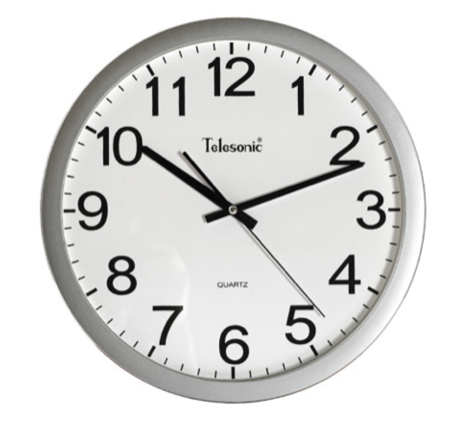

    解析: 参考方法

    $$
    \begin{align*}
    &解：\\
    &1）此钟表一共60条刻度，两条相邻刻度线间叫1格，时针每走1格是{60\over5}=12分钟，即速度是{1\over12}格/分。\\
    &以0点为起点，则时针走了(2\times5+{t\over12})格，分针走了t格，可分为两种情况：\\
    &情况一，分针在前：{2\times5}+{t\over12}=t+1,t=9{9\over11}\\
    &情况二，分针在后：{2\times5}+{t\over12}+1=t,t=12\\
    &根据题意，时针和分针均在刻度线上，所以t=12（分）\\
    &2）设这块残片所表示的时间是x点y分，其中x,y都是整数,以0点为起点，则时针走了(5x+{y\over12})格，分针走了y格。\\
    &\because\,5x+{y\over12}为整数\\
    &\therefore\,y=0,12,24,36,48\\
    &同样分两种情况，当分针在前时，y=5x+{y\over12}+1,当y=12时，即为1）中的答案。\\
    &情况二，当分针在后，5x+{y\over12}=y+1,当y=48时，x=9也符合题意。即这块残片也可表示9点48分。
    \end{align*}
    $$

48. 如图，正方形边长2厘米，求两阴影部分面积相差多少平方厘米。（$\pi取3.14$）

    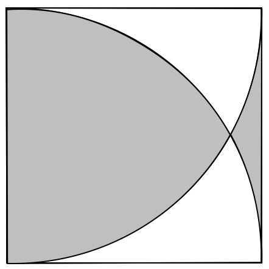

    解析: 参考方法

    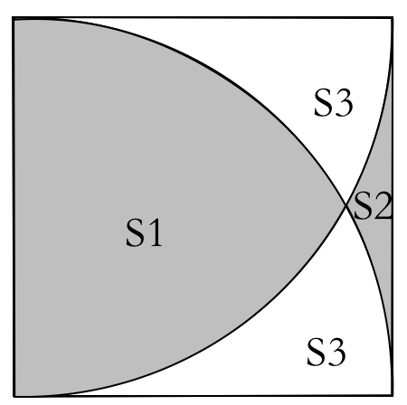

    $$
    \begin{align*}
    &解：如上图阴影分为四个部分，其中的空白部分相等，设为S_3，大的阴影设为S_1，小阴影部分设为S_2。\\
    &S_1-S_2=(S_1+S_3)-(S_2+S_3)\\
    &S_1-S_2=({1\over4}\times\pi\times2^2)-(4-{1\over4}\times\pi\times2^2)\\
    &S_1-S_2=2\pi-4\\
    &S_1-S_2=2.28\\
    &答：阴影部分的差为2.28平方厘米。
    \end{align*}
    $$

49. 客车与货车同时从甲、乙两站相对开出，客车每小时行54千米，货车每小时行48千米，两车相遇后又以原来的速度继续前进，客车到乙站后立即返回，货车到甲站后也立即返回，两车再相遇时客车比货车多行了216千米，求甲、乙两站的距离。

    

    解析: 参考方法

    $$
    \begin{align*}
    &解：设两车再次相遇时行驶了t小时，根据题意列方程：\\
    &(54-48)t=216\\
    &解这个方程：t=36\\
    &两站之间的距离为：(54+48)\times36\times{1\over3}=1224（千米）\\
    &答：甲、乙两站间的距离是1224千米。
    \end{align*}
    $$

50. 如图，求阴影部分的面积。（$\pi取3.14$）

    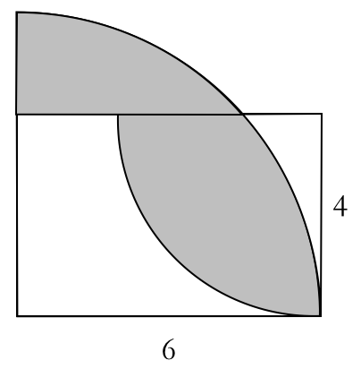

	解析: 参考方法

	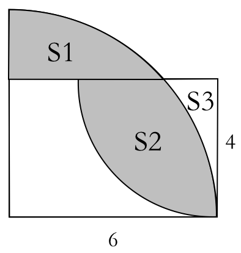

    $$
    \begin{align*}
    &解：按上图区域分割，转化为求S1+S2\\
    &S1=S_{大扇形}-S_{长方形}+S3\\
    &S2=S_{小扇形}-S3\\
    &\therefore\,S1+S2=S_{大扇形}-S_{长方形}+S3+S_{小扇形}-S3\\
	&S1+S2=S_{大扇形}-S_{长方形}+S_{小扇形}\\
	&={1\over4}\times\pi\times6^2-6\times4+{1\over4}\times\pi\times4^2\\
	&=13\pi-24\\
	&=16.82\\
    &答：图中阴影部分的面积是16.82。
    \end{align*}
    $$

51. 一辆小汽车从甲地开往乙地，第一小时行驶了全程的${1\over5}$，第二小时行驶了余下的$12.5\%$，此时离中点还有40千米。求甲乙两地相距多少千米？

	

	解析: 参考方法

    $$
    \begin{align*}
    &解：40千米占全程的比为：{1\over2}-{1\over5}-(1-{1\over5})\times{12.5\%}，列式得：\\
    &40\div({1\over2}-{1\over5}-{4\over5}\times{12.5\%})\\
    &=200(千米)\\
    &答：甲乙两站间的距离是200千米。
    \end{align*}
    $$

52. 小明早上从家步行去学校，走完一半路程时，爸爸发现小明的数学课本丢在家里，随即开车去给小明送书，走上时，小明还有${3\over10}$的路程未走完，小明随即上了爸爸的车，由爸爸送往学校，这样，小明比独自步行提早5分钟到校，求小明从家到学校全部步行需要多少时间？

	

	解析: 参考方法

    $$
    \begin{align*}
    &解：小明爸爸在距学校{3\over10}处追上小明，在相同时间，小明走了全程的{1\over2}-{3\over10}={1\over5},爸爸走了1-{3\over10}={7\over10}\\
    &在相同时间，速度比等于路程比，即V_{小明}:V_车={1\over5}:{7\over10}=2:7\\
    &设后{3\over10}路程小明步行需要t分钟，根据步行与坐车路程相等可列方程：\\
	&V_{小明}t=V_车\times(t-5)\\
	&V_{小明}:V_车=(t-2):t=2:7\\
	&t=7\\
	&7\div{3\over10}={70\over3}（分钟）\\
    &答：小明从家到学校全部步行需要{70\over3}分钟。
    \end{align*}
    $$

53. 某工厂男工人数的一半加上女工人数的${1\over4}$正好是240人，女工人数的一半加上男工人数的${1\over4}$正好是210人，这个工厂男工有多少人？

	

	解析: 参考方法

    $$
    \begin{align*}
	&解：设男工人数为x，根据女工人数相等列方程。\\
	&(240-{1\over2}x)\div{1\over4}=(210-{1\over4}x)\div{1\over2}\\
	&x=360\\
	&答：男工人数共有360人。
	\ebd{align*}
	$$

##### 八、文字式题

1. $12的{6\over5}倍加上{3\over5}再去除{9\over10},商是多少？$

	

	解析: 参考方法

	$$
	\begin{align*}
	&解：{9\over\,10}\div(12\times\,{6\over\,5}+{3\over\,5})={3\over\,50}
	\end{align*}
	$$

2. 一个数与$5\over9$的比值等于$20$的$3\over4$，列方程求这个数。

	

	解析: 参考方法

	$$
	\begin{align*}
	&解：x:{5\over\,9}=20\times\,{3\over\,4};\;x=8{1\over\,3}
	\end{align*}
	$$

3. 甲数的25%是1.25，乙数是60的20%，乙数是甲数的百分之几？

	

	解析: 参考方法

	$$
	\begin{align*}
	&解：{{60\times\,20\%}\over\,{1.25\div\,0.25}}\times\,100\%=240\%
	\end{align*}
	$$

4. 用$3\over5$减去$3\over20$的差除以12.5与0.8的积，商是多少？列式计算

	

	解析: 参考方法

	$$
	\begin{align*}
	&解：({3\over\,5}-{3\over\,20})\div(12.5\times\,0.8)={9\over\,200}
	\end{align*}
	$$

5. $3\over\,2$与$1\over\,2$的差乘以$5\over\,9$与$3\over\,7$的和，积是多少？

	

	解析: 参考方法

	$$
	\begin{align*}
	&解：({3\over2}-{1\over2})\times({5\over9}+{3\over7})={62\over63}
	\end{align*}
	$$

6. 1.5除307.5的商加上0.5乘12的积，和是多少？

	

	解析: 参考方法

	$$
	\begin{align*}
	&解：{{307.5}\div{1.5}}+0.5\times12=211
	\end{align*}
	$$

##### 九、操作题

1. 画一画，填一填。

	

	$1)\quad$画出平行四边形$ABCD$向右平移4格后的图形。点$A$平移后的位置用数对表示是\_\_\_\_\_\_\_\_\_。

	$2)\quad$画出将平行四边形$ABCD$绕$C$点按顺时针方向旋转$90$&deg;后的图形。点$D$旋转后的位置用数对表示是\_\_\_\_\_\_\_\_\_。

	$3)\quad$画出平行四边形$ABCD$按$2:1$的比放大后的图形。如果每个小方格表示$1cm^2$，那么放大后的平行四边形的面积是\_\_\_\_\_\_\_\_\_$cm^2$，放大后的平行四边形与原平行

	解析: $\underline{(6,2)}\quad\,\underline{(6,7)}\quad\,24$

	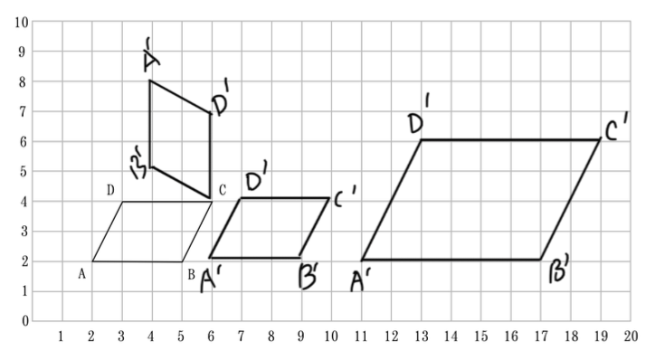


2. 利用平移或旋转的知识求下面各图形中阴影部分的面积。（单位：cm）

	
	
	
	

	解析: 参考方法

	$$
	\begin{align*}
	&解：\\
	&1:\quad{1\over\,4}\pi\times\,(1+2+3)^2=9\pi=28.26\\
	&2:\quad{6\times6=36}
	\end{align*}
	$$

3. 按要求完成下面各题。

	$1)\quad在下面的方格纸上画一个直角三角形ABC，其中两个锐角顶点A、B分别在(5,7)和(1,3)的位置上，直角顶点$C$的位置是(\_\_\_\_\_\_\_\_\_,3)$。

	$2)\quad画出直角三角形ABC先向右平移5格，再向下平移3格后的图形。$

	$3)\quad画出直角三角形ABC，按1:2缩小后的图形。$

	

	解析: $\underline{5},\;如图$

	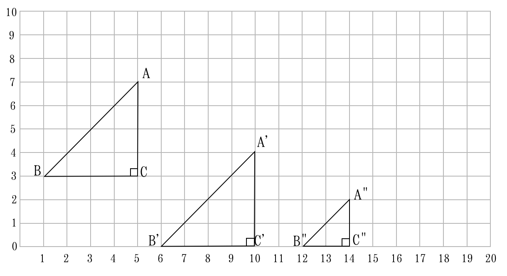

4. 如果每个小正方形的边长表示1厘米，请按要求画图形。

	

	$1)\quad把图①按 2:1的比放大。$

	$2)\quad把图①绕B点逆时针旋转90度。$

	$3)\quad在点A点南偏东45\degree方向画一个直径4厘米的圆。$

	解析: 如图

	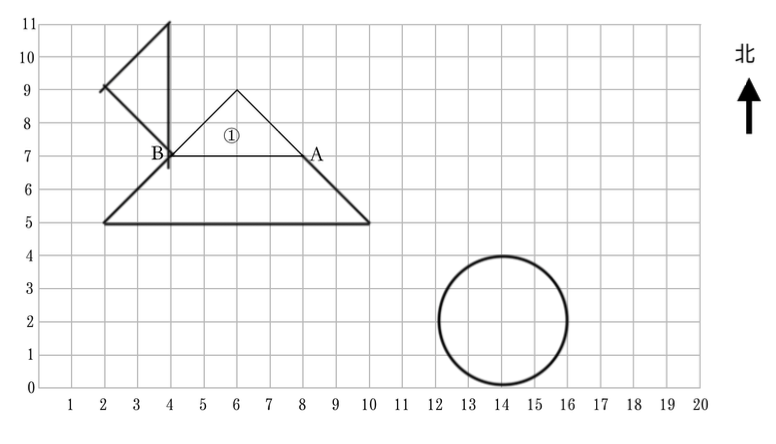

5. 一座塔高30米，小芳分另登上塔的 $A、B$两处向远处的家晀望，请你画出小芳在$A$处和$B$处时，看到的最近的点$A’$和$B’$。

	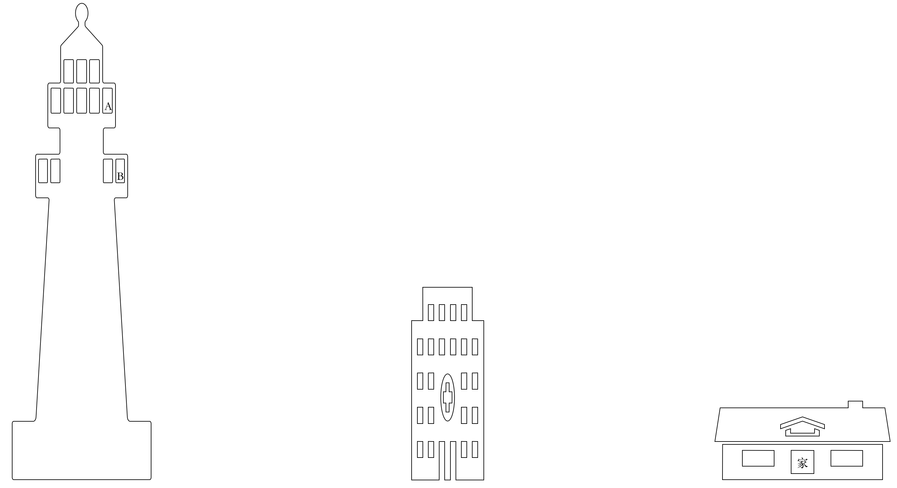

	解析: 如图

	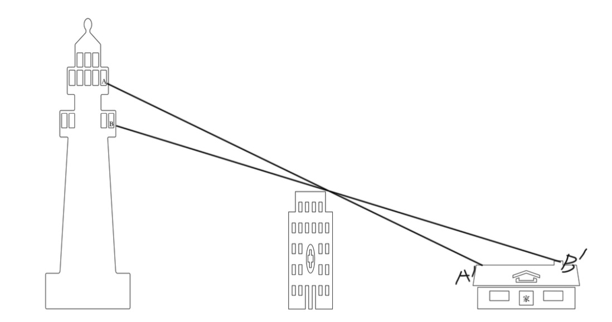

6. 我校校园平面近似于一个长方形，实验楼在东面，新教学楼在南面，大门在西面，东西相距约90米，南北相距约70米，（除宿舍楼外）请你：

	$1)\quad选定比例尺；$

	$2)\quad画出校园平面图；$

	$3)\quad标出大门、实验楼、新教学楼位置。$

	

	解析: 如图
	
	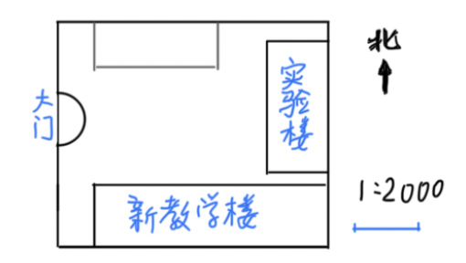

7. 请将下面等边三角形按要求分割成若干个形状和大小都一样的三角形。

	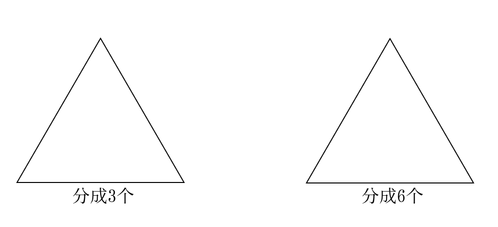

	解析: 如图

	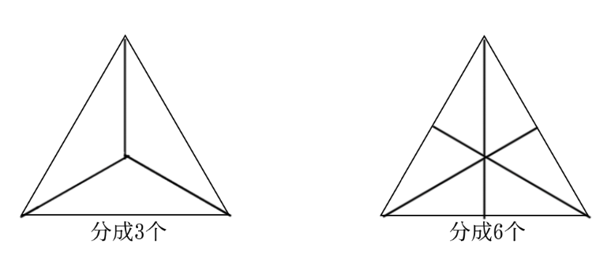

8. 如图，$A$圈内是$42$的约数，$B$圈内是$56$的约数，$C$圈内是$63$的约数，请在图中适当的位置填上符合要求的数。

	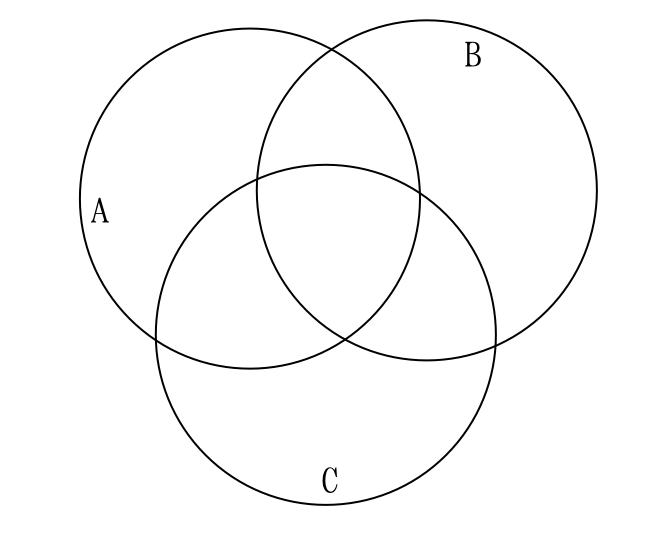

	解析: 如图

	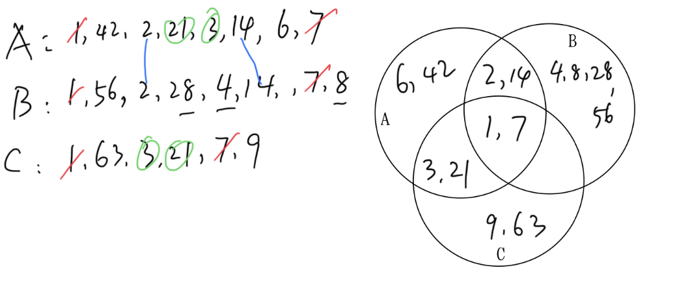

##### 十、有理数计算

1. $(-0.25)^{2005}\times4^{2004}$

	

	解析: 参考方法

	$$
	\begin{align*}
	&=(-{1\over4}\times4)^{2004}\times(-{1\over4})\\
	&=1\times(-{1\over4})\\
	&=-{1\over4}
	\end{align*}
	$$

2. $-{2\over7}-(-{1\over2})+|-1{1\over2}|$

	

	解析: 参考方法

	$$
	\begin{align*}
	&=-{2\over7}+{1\over2}+1{1\over2}\\
	&=-{2\over7}+2\\
	&=1{5\over7}
	\end{align*}
	$$

3. $(-1)^{25}-(1-0.5)\times{1\over3}$

	

	解析: 参考方法

	$$
	\begin{align*}
	&=-1-{1\over6}\\
	&=-1{1\over6}
	\end{align*}
	$$

4. $3-(-2)\times(-1)-8\div(-{1\over2})^2\times|-3+1|$

	

	解析: 参考方法

	$$
	\begin{align*}
	&=3-2-8\times4\times2\\
	&=-47
	\end{align*}
	$$

5. $(-27{9\over11})\div9-({1\over2}+{2\over3}-{3\over4}-{11\over12})\times(-24)$

	

	解析: 参考方法

	$$
	\begin{align*}
	&=-(27+{9\over11})\div9+12+16-18-22\\
	&=-3-{1\over11}-12\\
	&=-15{1\over11}
	\end{align*}
	$$

6. $|-3{8\over11}|-|-{17\over10}|+(-{9\over11})-(-3{4\over5})$

	

	解析: 参考方法

	$$
	\begin{align*}
	&=3{8\over11}-{17\over10}-{9\over11}+3{4\over5}\\
	&=2{10\over11}+2{1\over10}\\
	&=5{1\over110}
	\end{align*}
	$$

7. $(+0.125)+(3{1\over4})-(3{1\over8})+(11{2\over11})+(-0.25)$

	

	解析: 参考方法

	$$
	\begin{align*}
	&={1\over8}+(3{1\over4})-(3{1\over8})+(11{2\over11})-{1\over4}\\
	&=11{2\over11}
	\end{align*}
	$$

8. $211\times(-455)+365\times455-211\times545+545\times365$

	

	解析: 参考方法

	$$
	\begin{align*}
	&=365\times(455+545)-211\times(455+545)\\
	&=(365-211)\times1000\\
	&=154000
	\end{align*}
	$$

9. $-1^{10}-({13\over14}-{11\over12})\times[9-(-3)^2]+{1\over2}\div3$

	

	解析: 参考方法

	$$
	\begin{align*}
	&=-1-({13\over14}-{11\over12})\times0+{1\over6}\\
	&=-{5\over6}
	\end{align*}
	$$

10. $(-1)^8-({1\over2}-{2\over3})\div(-{1\over6})\times[-2-(-3)^2]-|{1\over8}-0.5^2|$

	

	解析: 参考方法

	$$
	\begin{align*}
	&=1+{1\over6}\times(-6)\times(-11)-{1\over8}\\
	&=11{7\over8}
	\end{align*}
	$$

11. $-117\times({1\over32}-0.125)\div(-1.2)\times(-1{3\over13})$

	

	解析: 参考方法

	$$
	\begin{align*}
	&=-117\times(-{3\over32})\times(-{5\over6})\times(-{16\over13})\\
	&=11{1\over4}
	\end{align*}
	$$

12. $[30-({7\over9}+{5\over6}-{11\over12})\times(-36)]\div(-5)$

	

	解析: 参考方法

	$$
	\begin{align*}
	&=(30+28+30-33)\div(-5)\\
	&=-11
	\end{align*}
	$$

13. $(+1{2\over7})\div(-{3\over4})\div(-{15\over14})\times(-{5\over8})$

	

	解析: 参考方法

	$$
	\begin{align*}
	&={9\over7}\times(-{4\over3})\times(-{14\over15})\times(-{5\over8})\\
	&=-1
	\end{align*}
	$$

